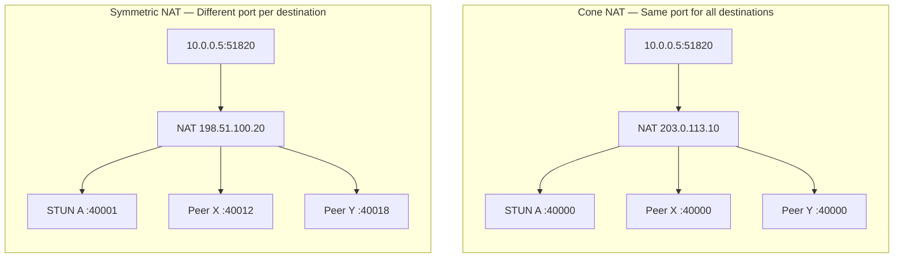
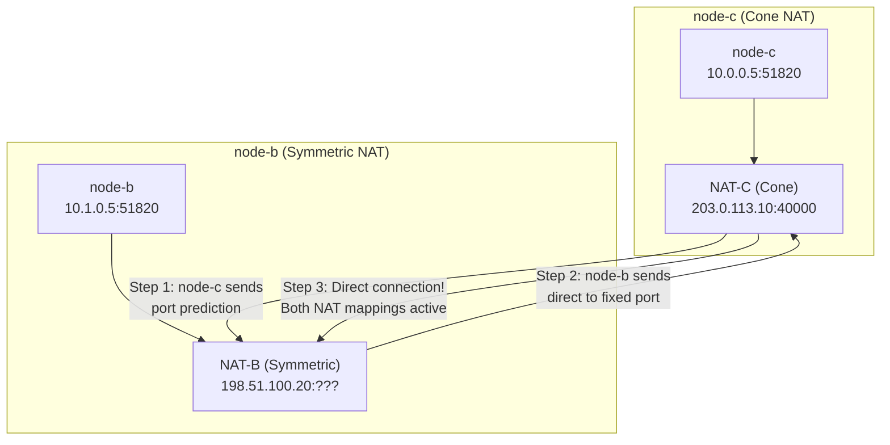
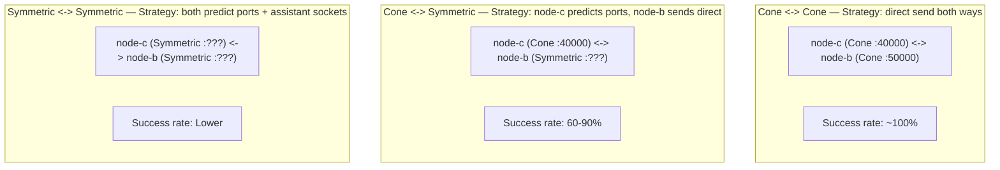
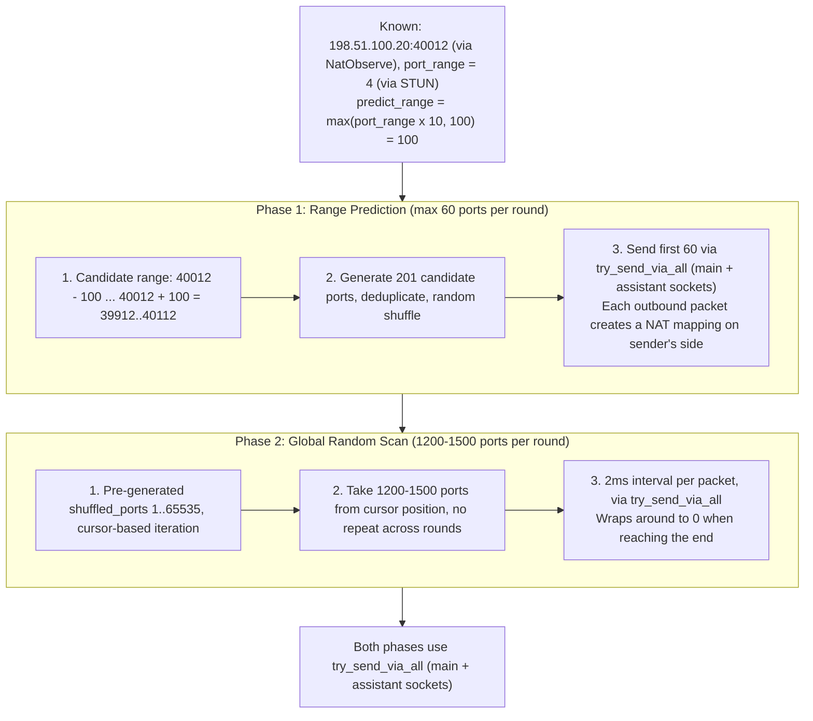
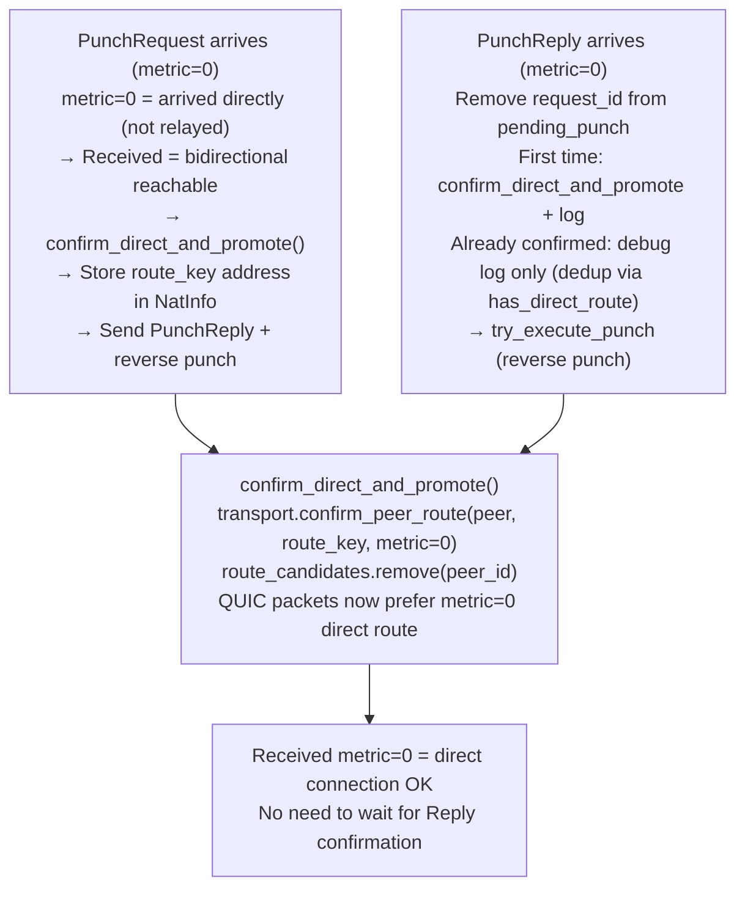
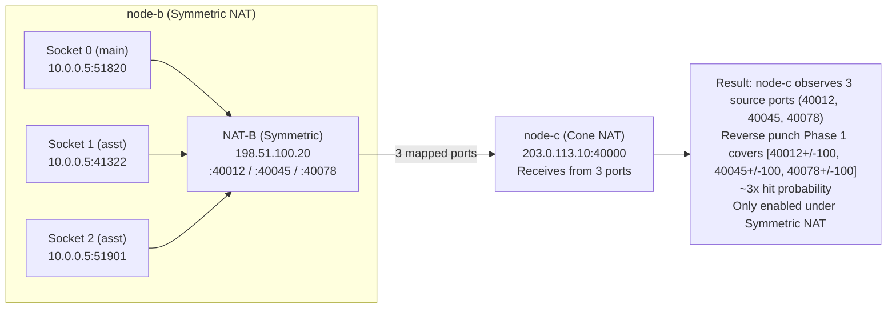

# P2P NAT Traversal: Principles and Implementation

> This document describes the complete principles, workflow, and strategies for NAT traversal
> (UDP hole punching) in the rustp2p project, and analyzes the health-check mechanisms for
> direct connections established after successful hole punching.

---

## Table of Contents

1. [NAT Type Overview](#1-nat-type-overview)
2. [Core Principle: Why Hole Punching Works](#2-core-principle-why-hole-punching-works)
3. [NAT Type Combinations and Punching Strategies](#3-nat-type-combinations-and-punching-strategies)
4. [Complete rustp2p Hole Punching Workflow](#4-complete-rustp2p-hole-punching-workflow)
5. [Key Mechanisms in Detail](#5-key-mechanisms-in-detail)
6. [Complete Example Scenario](#6-complete-example-scenario)
7. [Direct Connection Health Check](#7-direct-connection-health-check)

---

## 1. NAT Type Overview

rustp2p simplifies NAT into two categories: **Cone NAT** and **Symmetric NAT**.



### 1.1 Cone NAT

**Characteristic**: The same internal socket (IP:Port) uses the **same mapped port** for **all external destinations**.

```
+----------------------------------------------+
|              Cone NAT Mapping Table           |
|                                              |
|  Internal 10.0.0.5:51820 -> Public 203.0.113.10:40000
|                                              |
|  To STUN Server A  -> source port 40000      |
|  To STUN Server B  -> source port 40000      |
|  To Peer X         -> source port 40000      |
|  To Peer Y         -> source port 40000      |
|  (All destinations share the same mapped port)|
+----------------------------------------------+
```

**Traversal advantage**: The mapped port is fixed and predictable. The peer only needs to know one public address to connect directly.

Cone NAT can be further classified into three subtypes (rustp2p does not differentiate; all are treated as Cone):

| Subtype | Inbound packet admission rule | Traversal difficulty |
|---------|------------------------------|---------------------|
| Full Cone | Any source IP allowed | Easiest |
| Restricted Cone | Source IP must match a previously contacted IP | Easy |
| Port Restricted Cone | Source IP + source port must both match | Harder |

### 1.2 Symmetric NAT

**Characteristic**: The same internal socket assigns **different mapped ports** for **different external destinations**.

```
+--------------------------------------------------+
|             Symmetric NAT Mapping Table           |
|                                                  |
|  Internal 10.0.0.5:51820                         |
|    +-- To STUN Server A  -> source port 40001    |
|    +-- To STUN Server B  -> source port 40005    |
|    +-- To Peer X         -> source port 40012    |
|    +-- To Peer Y         -> source port 40018    |
|    (Each destination gets a different port,      |
|     ports follow a sequential increment pattern)  |
+--------------------------------------------------+
```

**Traversal challenge**: The peer cannot predict which port the Symmetric NAT will assign for its connection. Port prediction ("guessing") is required.

---

## 2. Core Principle: Why Hole Punching Works

### 2.1 The Essence of Hole Punching

The core principle of UDP hole punching: **Both peers simultaneously send packets to each other, each creating an outbound mapping on their own NAT. This mapping allows the other peer's inbound packets to pass through.**



```
              Public Internet
    +----------------------------------+
    |                                  |
    |   NAT-C          NAT-B           |
    |  (Cone)        (Symmetric)       |
    |  203.0.113.10  198.51.100.20     |
    +-----+--------------+-------------+
          |              |
     +----+----+   +----+----+
     | node-c  |   | node-b  |
     | 10.0.0.5|   | 10.1.0.5|
     +---------+   +---------+

Step 1: node-c sends packets to node-b's public IP (port prediction)
  -> node-c's NAT creates mapping: allow inbound from 198.51.100.20

Step 2: node-b sends packets to node-c's public address (Cone port is fixed)
  -> node-b's NAT assigns a new port for this destination
  -> Packet arrives at node-c's NAT, source IP matches -> admitted!

Step 3: Direct connection established between both peers
```

### 2.2 Why Simultaneous Bidirectional Punching Is Required

Unidirectional packet sending is not enough. If only node-b sends to node-c, and node-c has never sent a packet to node-b:

- If node-c is behind **Restricted Cone NAT**: node-c's NAT will reject the packet (no outbound record for 198.51.100.20)
- If node-c is behind **Port Restricted Cone NAT**: Even stricter — the port must also match

Only when node-c **also sends packets to node-b's IP** will node-c's NAT create an admission rule allowing inbound packets from that IP.

**This is why rustp2p performs hole punching bidirectionally and simultaneously** — each peer opens a "hole" in the other's NAT.

---

## 3. NAT Type Combinations and Punching Strategies

Different NAT type combinations have different success rates:



### 3.1 Cone <-> Cone (Easiest)

```
node-c (Cone, 203.0.113.10:40000)
node-b (Cone, 198.51.100.20:50000)

Both peers have fixed ports, just send directly to each other:
  node-c -> 198.51.100.20:50000  (direct send)
  node-b -> 203.0.113.10:40000   (direct send)

Success rate: ~100%
```

### 3.2 Cone <-> Symmetric (Common Scenario)

```
node-c (Cone, 203.0.113.10:40000)        <- port is fixed
node-b (Symmetric, 198.51.100.20:???)    <- port is NOT fixed

Strategy:
  node-c -> node-b: Port prediction (Phase 1 range prediction + Phase 2 global scan)
  node-b -> node-c: Direct send to 203.0.113.10:40000 (Cone port is fixed)

Success rate: Depends on port prediction hit rate, typically 60-90%
```

### 3.3 Symmetric <-> Symmetric (Hardest)

```
node-c (Symmetric, 203.0.113.10:???)
node-b (Symmetric, 198.51.100.20:???)

Both peers have non-fixed ports, mutual port prediction:
  node-c -> node-b: Predict ports (based on known port range)
  node-b -> node-c: Predict ports (based on known port range)

Success rate: Lower, requires extensive port prediction and assistant sockets
```

---

## 4. Complete rustp2p Hole Punching Workflow

### 4.1 Overall Architecture

```
+-------------------------------------------------------------+
|                     rustp2p Architecture                     |
|                                                             |
|  +-----------------------------------------------------+   |
|  |              rustp2p-quic (Protocol Layer)           |   |
|  |                                                     |   |
|  |  ProtocolLayer                                      |   |
|  |  +- PunchRequest/PunchReply handling                |   |
|  |  +- NatObserve address discovery                    |   |
|  |  +- Route confirmation (confirm_direct_and_promote) |   |
|  |  +- Rate limiting (try_execute_punch)               |   |
|  |  +- Maintenance loop (start_maintenance_loop)       |   |
|  |  +- Heartbeat loop (start_heartbeat_loop)           |   |
|  +---------------------------+-------------------------+   |
|                              |                             |
|  +---------------------------+-------------------------+   |
|  |              rustp2p-core (Transport Layer)          |   |
|  |                                                     |   |
|  |  +----------+  +----------+  +------------------+  |   |
|  |  |  STUN    |  | Puncher  |  |  Endpoint        |  |   |
|  |  | NAT detect| | Punching |  |  SocketPool      |  |   |
|  |  |          |  | executor |  |  (main+assistant) |  |   |
|  |  +----------+  +----------+  +------------------+  |   |
|  +-----------------------------------------------------+   |
+-------------------------------------------------------------+
```

### 4.2 Phase 1: NAT Type Detection

```
+---------------------------------------------------------+
|                   STUN NAT Detection Flow                |
|                                                         |
|  stun_test_nat()                                        |
|  +- Create temporary UDP socket (0.0.0.0:0)             |
|  +- Send BindingRequest to STUN Server A                |
|  |   -> Get mapped address 203.0.113.10:40001           |
|  +- Send BindingRequest to STUN Server B                |
|  |   -> Get mapped address 203.0.113.10:40005           |
|  |                                                      |
|  +- Decision:                                           |
|  |   Same mapped address -> Cone NAT                    |
|  |   Different mapped addresses -> Symmetric NAT        |
|  |                                                      |
|  +- port_range calculation: max_port - min_port = 4    |
|  |                                                      |
|  +- apply_stun_result_to_nat_info:                      |
|      Only save nat_type and port_range                  |
|      (temp socket port != main socket port, unusable)   |
+---------------------------------------------------------+
```

> **Key Design**: STUN detection uses a temporary socket (`0.0.0.0:0`), whose mapped port
> differs from the main QUIC socket's port. Therefore, STUN results are **only used for NAT
> type classification and port range estimation**. Real public IP/port is discovered via NatObserve.

### 4.3 Phase 2: Public Address Discovery (NatObserve)

NatObserve leverages existing QUIC connections (via relay) to let the peer observe your actual source address:

```
+-------------+                    +-------------+
|   node-c    |                    |   node-b    |
|  (Cone NAT) |                    |(Symmetric)  |
+------+------+                    +------+------+
       |                                  |
       |  ---- NatObserveRequest ---->    |  (via relay)
       |                                  |
       |  <---- NatObserveReply ------    |  "The source address I observed for you is
       |                                  |   198.51.100.20:40012"
       |                                  |
       |  apply_observation_to_nat_info:  |
       |  public_ips = [198.51.100.20]    |
       |  public_udp_ports = [40012]      |
       +----------------------------------+
```

### 4.4 Phase 3: Endpoint Configuration (Assistant Sockets)

Dynamically adjust the socket pool based on NAT type:

```
apply_nat_model(NatType::Symmetric):
  +--------------------------------------------+
  |  Symmetric NAT -> Create Assistant Sockets |
  |                                            |
  |  Main Socket:     10.0.0.5:51820           |
  |  Assistant Socket 1: 10.0.0.5:41322       |
  |  Assistant Socket 2: 10.0.0.5:51901       |
  |  ...                                       |
  |                                            |
  |  Each socket has a different mapped port   |
  |  under Symmetric NAT, increasing the       |
  |  probability of hitting the peer's NAT     |
  +--------------------------------------------+

apply_nat_model(NatType::Cone):
  +--------------------------------------------+
  |  Cone NAT -> Remove Assistant Sockets      |
  |                                            |
  |  Keep only Main Socket: 10.0.0.5:51820     |
  |  (Cone NAT port is fixed, no need for      |
  |   multiple source ports)                   |
  +--------------------------------------------+
```

### 4.5 Phase 4: Hole Punching Execution

#### 4.5.1 Punching Triggers

Hole punching is triggered in three ways:

```
Trigger 1: Auto-punch loop (start_maintenance_loop, every 10s/peer)
  -> Automatically initiates punching for peers without direct routes

Trigger 2: Triggered upon receiving PunchRequest/PunchReply
  -> try_execute_punch (with rate limiting and address injection)

Trigger 3: Application-layer explicit call
  -> protocol.punch(peer_id)
```

#### 4.5.2 UDP Punching Strategy



```
punch_udp() selects strategy based on peer's NAT type:

+-------------------------------------------------------------+
|                    Common Pre-steps                          |
|  1. Send to mapping_udp_addr (manual port mapping)          |
|  2. Send to local_ipv4_addrs (same LAN)                     |
+---------------------------+----------------------------------+
                            |
              +-------------+-------------+
              v                           v
+---------------------+   +---------------------------------+
|   Peer is Cone NAT  |   |    Peer is Symmetric NAT         |
|                     |   |                                 |
|  Strategy: Direct   |   |  Phase 1: Range Prediction      |
|  Send               |   |  (max 60 ports)                 |
|                     |   |  +- predict_range =              |
|  for addr in        |   |  |   max(port_range x 10, 100)  |
|    public_addrs:    |   |  +- Generate [base +/- range]   |
|    try_send_via_all |   |  |   candidates                  |
|      (buf, addr)    |   |  +- Deduplicate + shuffle        |
|                     |   |  +- Send first 60                |
|  (Cone port fixed,  |   |                                 |
|   just send direct) |   |  Phase 2: Global Random Scan     |
|                     |   |  (1200-1500 ports/round)        |
|                     |   |  +- Use pre-generated            |
|                     |   |  |   shuffled_ports (1-65535)   |
|                     |   |  +- port_cursor persistent       |
|                     |   |  |   cursor, no repeat           |
|                     |   |  +- 2ms interval per packet      |
|                     |   |                                 |
|                     |   |  Send method: try_send_via_all   |
|                     |   |  (main + assistant sockets)      |
+---------------------+   +---------------------------------+
```

#### 4.5.3 Symmetric NAT Port Prediction in Detail

```
Assume peer (Symmetric NAT) known info:
  public_ips = [198.51.100.20]
  public_udp_ports = [40012]  (one mapped port obtained via NatObserve)
  port_range = 4  (port variation range detected by STUN)

Phase 1 Prediction:
  predict_range = max(4 x 10, 100) = 100
  Candidate port range: [40012 - 100, 40012 + 100] = [39912, 40112]
  -> Generate 201 candidate ports
  -> Deduplicate + random shuffle
  -> Send to first 60
  -> Each port sent via main + assistant sockets

Phase 2 Global Scan:
  Start from shuffled_ports[0], take 1200-1500 random ports
  Next round continues from where the last round ended (port_cursor)
  Wrap around to 0 when reaching the end
```

> **Why multiply predict_range by 10?** Because the peer has multiple sockets (main + assistant),
> each with independent port allocation under Symmetric NAT. The port difference between different
> sockets may be much larger than the port difference for a single socket across different destinations.

### 4.6 Phase 5: Route Confirmation


```
+-------------------------------------------------------------+
|                    Route Confirmation Flow                   |
|                                                             |
|  PunchRequest arrives (metric=0):                           |
|  +-----------------------------------------------------+   |
|  |  metric=0 means the packet arrived directly          |   |
|  |  (not relayed)                                       |   |
|  |  -> Received = bidirectional reachable = direct OK!  |   |
|  |  -> Immediately confirm_direct_and_promote           |   |
|  |     (no need to wait for Reply)                      |   |
|  |  -> Store in route_candidates                        |   |
|  |  -> try_execute_punch (reverse punch, help peer)     |   |
|  |  -> Send PunchReply                                  |   |
|  +-----------------------------------------------------+   |
|                                                             |
|  PunchReply arrives (metric=0, request_id matches):        |
|  +-----------------------------------------------------+   |
|  |  Remove request_id from pending_punch                |   |
|  |  -> First time: confirm_direct_and_promote + log     |   |
|  |  -> Already confirmed: debug log only (dedup)        |   |
|  |  -> try_execute_punch (reverse punch)                |   |
|  +-----------------------------------------------------+   |
|                                                             |
|  confirm_direct_and_promote:                                |
|  -> transport.confirm_peer_route(peer, route_key, metric=0)|
|  -> route_candidates.remove(peer_id)                        |
|  -> Subsequent QUIC handshake packets prefer metric=0 route |
+-------------------------------------------------------------+
```

#### Why Can PunchRequest (metric=0) Directly Confirm Direct Connection?

This is a reliable inference based on NAT mapping principles:

```
node-b sends PunchRequest -> node-c

  1. Packet leaves node-b's socket, passes through node-b's NAT
  2. Packet traverses the public internet to node-c's NAT
  3. node-c's NAT admits it (because node-c also sent packets to node-b,
     so the mapping already exists)
  4. Packet arrives at node-c's socket

  Receiving a metric=0 packet = node-b can send to node-c = node-c can reply to node-b
  (because node-c's NAT mapping already allows traffic in this direction)

  Therefore: Received = bidirectional reachable = direct connection successful
```

---

## 5. Key Mechanisms in Detail

### 5.1 Assistant Socket



```
+--------------------------------------------------------+
|              Purpose of Assistant Sockets              |
|                                                        |
|  Only enabled under Symmetric NAT.                     |
|                                                        |
|  Scenario: node-b (Symmetric) punching to node-c (Cone)|
|                                                        |
|  node-b has 3 sockets:                                 |
|    Socket 0 (main): -> NAT mapping 198.51.100.20:40012|
|    Socket 1 (asst): -> NAT mapping 198.51.100.20:40045|
|    Socket 2 (asst): -> NAT mapping 198.51.100.20:40078|
|                                                        |
|  When try_send_via_all sends to node-c:                |
|    Socket 0 -> 198.51.100.20:40012 -> 203.0.113.10:40000
|    Socket 1 -> 198.51.100.20:40045 -> 203.0.113.10:40000
|    Socket 2 -> 198.51.100.20:40078 -> 203.0.113.10:40000
|                                                        |
|  node-c receives and observes 3 source ports from node-b:
|    40012, 40045, 40078                                 |
|                                                        |
|  When node-c reverse-punches to node-b:                |
|    Phase 1 prediction covers: [40012+/-100, 40045+/-100, 40078+/-100]
|    -> Hit probability ~3x higher                       |
|                                                        |
|  Also, all 3 of node-b's sockets are listening:        |
|    If node-c's prediction hits Socket 1's mapped port, |
|    Socket 1 also receives it -> assistant socket can   |
|    also establish direct connection                    |
+--------------------------------------------------------+
```

### 5.2 Direct Address Injection

When a PunchRequest arrives via a direct route (metric=0), the source address in route_key is more accurate than the public address in the peer's NatInfo:

```
Problem scenario:
  node-c learned node-b's address via NatObserve: 198.51.100.20:40012
  But 40012 is the mapped port for node-b's connection to the NatObserve relay node

  When node-b directly sends a PunchRequest to node-c:
    node-b's NAT assigns a new port for the node-c destination: 40035
    -> route_key address is 198.51.100.20:40035 (more accurate!)

  try_execute_punch injects:
    nat_info.public_ips = [198.51.100.20]
    nat_info.public_udp_ports = [40012, 40035]  <- inject route_key port

  -> Phase 1 prediction now covers ranges around both 40012 and 40035
  -> Higher hit probability
```

### 5.3 Rate Limiting and Backoff

```
Multi-layer rate limiting:

ProtocolLayer:
  +----------------------------------------------+
  | try_execute_punch rate limit:                |
  | +- Already has direct route -> skip          |
  | |   (has_direct_route)                       |
  | +- metric > 0 (relay arrival) -> 5s limit    |
  | +- metric = 0 (direct arrival) -> no limit   |
  |   (direct arrival is the best hit            |
  |    opportunity, should not be limited)       |
  +----------------------------------------------+

  +----------------------------------------------+
  | auto-punch loop rate limit:                  |
  | +- Max once per 10s per peer                 |
  +----------------------------------------------+

Puncher:
  +----------------------------------------------+
  | need_punch backoff:                          |
  | +- First 8 times: punch every time          |
  | +- After 8 times: exponential backoff       |
  |    interval = total_count / 8 (cap 360)     |
  |    Only punch when total_count % interval == 0|
  +----------------------------------------------+
```

### 5.4 NatObserve Address vs Actual Punching Address

```
Address observed by node-b via node-a (relay):
  198.51.100.20:40012  (this is the mapped port for node-b -> node-a direction)

Address assigned when node-b directly punches to node-c:
  198.51.100.20:40035  (this is the mapped port for node-b -> node-c direction)

Why are they different?
  Symmetric NAT assigns different ports for different destinations
  node-a and node-c are different destinations -> different ports

  40012 != 40035, but usually within a similar range (determined by port_range)
  Phase 1 prediction covers port ranges around both -> can still hit
```

---

## 6. Complete Example Scenario

### Scenario: Three-Node Network (node-a relay + node-b/node-c punching)

```
Network topology:
  node-a: Public server 203.0.113.1 (no NAT, acts as relay)
  node-b: Symmetric NAT, public IP 198.51.100.20
  node-c: Cone NAT, public IP 203.0.113.10
```

#### Step 1: Initial Connection (via relay)

```
node-b ---- connect ----> node-a (relay) <---- connect ---- node-c
         (QUIC via relay)                    (QUIC via relay)

node-c observes node-b's source address via NatObserve: 198.51.100.20:40012
node-b observes node-c's source address via NatObserve: 203.0.113.10:40000
```

#### Step 2: Auto-Punch Trigger

```
node-c's maintenance_loop detects:
  - peer node-b has no direct route (has_direct_route = false)
  - Has node-b's NatInfo: { ips: [198.51.100.20], ports: [40012], type: Symmetric, port_range: 4 }

-> Trigger execute_punch(node-b, nat_info)
-> Build PunchRequest, call Puncher::punch_now
```

#### Step 3: node-c Executes Punching (sends to node-b)

```
node-c's Puncher executes punch_udp:

  Peer is Symmetric NAT -> Two-phase strategy

  Phase 1 (Range Prediction, max 60 ports):
    predict_range = max(4 x 10, 100) = 100
    Candidate range: [40012-100, 40012+100] = [39912, 40112]
    -> 201 candidates, deduplicate + shuffle, take first 60
    -> Send via main socket to 198.51.100.20:candidate_port

    * Each outbound packet passes through node-c's Cone NAT
    * Cone NAT records: "Allow inbound traffic from 198.51.100.20"

  Phase 2 (Global Random Scan, 1200-1500 ports):
    Take 1350 random ports from shuffled_ports cursor position
    -> Send via main socket to 198.51.100.20:random_port
```

#### Step 4: node-b Executes Punching (sends to node-c)

```
node-b receives node-c's PunchRequest via relay (metric > 0)
-> try_execute_punch triggers reverse punch
-> Rate limit check: not punched in last 5s -> allowed

  Peer is Cone NAT -> Direct send strategy

  for addr in node-c's public addresses:
    try_send_via_all(PunchRequest, 203.0.113.10:40000)
    -> Main socket send:     198.51.100.20:40035 -> 203.0.113.10:40000
    -> Assistant socket 1:   198.51.100.20:40058 -> 203.0.113.10:40000
    -> Assistant socket 2:   198.51.100.20:40081 -> 203.0.113.10:40000
```

#### Step 5: Direct Connection Success

```
Case A: node-b's packet arrives at node-c first (Cone NAT admits it)
  -> node-c receives PunchRequest, metric=0
  -> Confirm direct! confirm_direct_and_promote
  -> Send PunchReply (via direct route)

Case B: node-c's prediction packet hits one of node-b's sockets first
  -> node-b receives PunchRequest, metric=0
  -> Confirm direct! confirm_direct_and_promote
  -> Send PunchReply (via direct route)

Both cases result in:
  node-c route table: node-b -> direct (metric=0, via 198.51.100.20:40035)
  node-b route table: node-c -> direct (metric=0, via 203.0.113.10:40000)
  -> QUIC handshake packets prefer direct route
  -> Direct QUIC connection established!
```

---

## 7. Direct Connection Health Check

### 7.1 Implemented Mechanism Overview

The health check mechanism has been implemented with three key components: heartbeat with RTT measurement, NAT mapping keepalive, and route idle eviction via IdleRouteManager.

```mermaid
flowchart TD
    HB["Heartbeat loop (start_heartbeat_loop, every 15s)<br/>Finds all peers with direct routes -> sends EchoRequest (8-byte timestamp)<br/>via direct route_key. Packets traverse UDP socket -> refreshes NAT mapping"]
    HB -->|EchoRequest via direct route_key| PEER
    PEER["Peer receives EchoRequest -> sends EchoReply (echoes back original timestamp)<br/>Also calls confirm_tcp_route() to ensure direct route is registered"]
    PEER -->|EchoReply (metric=0)| RTT
    RTT["EchoReply handler: RTT calculation<br/>rtt = now_millis() - sent_timestamp (discards replies older than 60s)<br/>-> transport.update_route_rtt(peer, route_key, rtt)"]
    RTT -->|updates route| TBL
    TBL["RouteTable::update_rtt()<br/>Updates Route.rtt for the specific route_key<br/>If LoadBalance::LowestLatency -> re-sorts routes by RTT"]
    TBL -->|if no read activity| IDLE
    IDLE["Route idle -> IdleRouteManager detects read-idle timeout<br/>-> remove_route() evicts stale route -> maintenance loop detects gap -> re-punch"]
```

### 7.2 Heartbeat + RTT Measurement

The heartbeat loop (`start_heartbeat_loop`) runs every **15 seconds** and sends `EchoRequest` to all peers that have at least one direct route (metric=0):

```
start_heartbeat_loop (every 15s):
  1. Collect all peers with direct routes (known_peers + routes filter is_direct)
  2. For each peer:
     a. Generate timestamp = now_millis()
     b. Store in pending_echo[peer_id] = timestamp
     c. Send EchoRequest with 8-byte big-endian timestamp payload
        via the direct route_key (send_protocol_to_route)
```

When the peer receives `EchoRequest`, it:
1. Calls `confirm_tcp_route()` to ensure the direct route is registered
2. Sends `EchoReply` back with the original timestamp payload

When `EchoReply` arrives (metric=0):
1. Extracts the sent timestamp from the 8-byte payload
2. Calculates `rtt = now_millis() - sent_timestamp`
3. Discards stale replies (older than 60 seconds)
4. Calls `transport.update_route_rtt(peer, route_key, rtt)` to update the route table
5. Logs RTT changes only when the delta exceeds 10ms (to avoid log spam)

### 7.3 NAT Mapping Keepalive

The heartbeat mechanism serves a dual purpose:

| Purpose | How it works |
|---------|-------------|
| **RTT measurement** | EchoReply carries back the original timestamp, enabling RTT calculation |
| **NAT keepalive** | EchoRequest packets are sent via the direct UDP route, refreshing NAT mappings on both sides every 15 seconds |
| **Route liveness** | Receiving EchoReply proves the direct route is still functional |
| **LowestLatency routing** | Updated RTT values enable proper route sorting when using `LoadBalance::LowestLatency` |

The 15-second interval is well below typical NAT mapping aging times (30-120 seconds), ensuring mappings stay alive during idle periods.

Additional indirect keepalive mechanisms:
- **NatObserveRequest** (every 10s): Sent to direct peers via QUIC datagram
- **Quinn internal PING frames**: Default behavior sends PING frames when idle (~30s timeout)
- **Application-layer data**: Continuous data transmission naturally keeps mappings active

### 7.4 Route Lifecycle and Idle Eviction

#### 7.4.1 Why Connection Drop Does NOT Remove Routes

The QUIC application-layer connection lifecycle is **deliberately separated** from the
underlying UDP/TCP path lifecycle. When a QUIC connection drops (idle timeout, local close,
etc.), the NAT mapping and the physical path may still be alive. Therefore,
`cleanup_connection` **intentionally does not touch the route table**:

```rust
fn cleanup_connection(&self, stable_id: usize, peer_id: Option<PeerId>) {
    self.connection_tasks.remove(&stable_id);
    if let Some(peer_id) = peer_id {
        // Only remove the cache entry if it still points to *this*
        // connection. A newer connection may have already replaced it.
        let removed = self
            .connections
            .remove_if(&peer_id, |_, conn| conn.quinn().stable_id() == stable_id);
        if removed.is_some() {
            self.socket.release_virtual_peer(&peer_id);
        }
        // Intentionally do NOT remove direct routes here.
        //
        // QUIC application-layer connection lifecycle is separate from
        // the underlying UDP/TCP path. The route table has its own read-idle
        // detection (IdleRouteManager) and heartbeat-driven activity refresh,
        // which are the correct mechanisms for route lifecycle.
    }
}
```

What `cleanup_connection` actually does:
1. Removes the connection task handle from `connection_tasks`
2. Removes the QUIC connection from `connections` **only if** it still points to the same connection (prevents removing a newer replacement)
3. Releases the virtual peer socket binding via `release_virtual_peer`

#### 7.4.2 IdleRouteManager — The Real Route Lifecycle Manager

Route eviction is handled by `IdleRouteManager` in `rustp2p-core`, which monitors read-idle
timeouts independently of QUIC connection state:

```
IdleRouteManager
  +- read_idle: Duration               (configured idle threshold)
  +- route_table: RouteTable<PeerID>   (shared with TransportLayer)

  next_idle() -> (PeerID, Route, Instant)
    +- Returns the next route whose last-read time exceeds read_idle
    +- Called by the maintenance loop to detect stale routes

  delay(peer_id, route_key) -> bool
    +- Pushes the route's read deadline forward (resets idle timer)
    +- Called when any traffic arrives on this route

  remove_route(peer_id, route_key)
    +- Evicts a single stale route from the route table
    +- This is what triggers re-punching
```

The flow from idle detection to re-punching:

```
1. IdleRouteManager detects route with no read activity for > read_idle
2. -> remove_route(peer_id, route_key) evicts the stale route
3. -> If it was the last direct route: has_direct_route(peer_id) = false
4. -> Maintenance loop detects the gap on next cycle (every 10s)
5. -> Auto-punch triggered (subject to rate limiting)
6. -> Relay routes preserved as fallback throughout
```

#### 7.4.3 Heartbeat Keeps Active Routes Alive

The heartbeat loop (Section 7.2) serves a dual role here: every `EchoRequest` /
`EchoReply` exchange calls `update_read_time()`, which in turn calls
`IdleRouteManager::delay()`, pushing the route's idle deadline forward. This means:

- **Active routes with working heartbeat** → never evicted (idle timer constantly refreshed)
- **Routes where heartbeat stops arriving** → NAT mapping likely dead → idle eviction → re-punch

### 7.5 Summary

| Mechanism | Status | Implementation |
|-----------|--------|----------------|
| Heartbeat / Keepalive | **Implemented** | `start_heartbeat_loop` sends EchoRequest every 15s to direct peers |
| RTT measurement | **Implemented** | EchoReply handler calculates RTT, calls `update_route_rtt()` |
| NAT mapping keepalive | **Implemented** | Heartbeat packets traverse UDP socket, refreshing NAT mappings |
| Route idle eviction | **Implemented** | `IdleRouteManager` monitors read-idle timeout, evicts stale routes via `remove_route()` |
| Route read-time refresh | **Implemented** | Heartbeat exchange calls `update_read_time()` → `IdleRouteManager::delay()` |
| Connection cleanup (cache only) | **Implemented** | `cleanup_connection` removes QUIC connection cache + virtual peer, **preserves route table** |
| Route table RTT sorting | **Implemented** | `update_rtt()` re-sorts routes when `LoadBalance::LowestLatency` is active |
| Per-route QUIC connections | **Implemented** | `VirtualPeer.route_key` binding + `via_connections` + `send_to_via` / `try_send_to_via` / `open_bi_via` API |

### 7.6 Per-Route QUIC Connections

```mermaid
flowchart TB
    REG[<b>VirtualPeer registration</b><br/>register_virtual_peer_via(peer, route_key)<br/>→ allocates synthetic address 127.0.0.1:9999<br/>→ VirtualPeer { peer_id, route_key: Some(rk) }<br/>→ via_virtual_addrs[(peer, rk)] = addr]
    QUI[<b>Quinn endpoint binds to synthetic addr</b><br/>Quinn thinks it sends to 127.0.0.1:9999<br/>QuicPeerSocket::try_send intercepts:<br/>→ finds VirtualPeer by destination addr<br/>→ route_key=Some → try_send_quic_payload_via]
    BYP[<b>try_send_quic_payload_via bypasses the route table</b><br/>Wraps payload as QuicRelay packet → try_send_wire_to_route(route_key) → direct UDP send on that path]
    DEF[<b>Default connection (route_key=None)</b><br/>Uses route table default (lowest metric)<br/>try_send_quic_payload → route table lookup]
    VIA[<b>Via connection (route_key=Some)</b><br/>Bypasses route table entirely<br/>try_send_quic_payload_via → direct wire send]

    REG -->|binds| QUI
    QUI --> BYP
    BYP --> DEF
    BYP --> VIA
```

The per-route QUIC mechanism allows applications to open a dedicated QUIC connection over a
**specific route** (e.g., a particular direct path or relay path), bypassing the route table's
default selection.

#### How It Works

The mechanism is built on **synthetic address binding**:

```
1. Application calls endpoint.open_bi_via(peer_id, route_key)
2. -> QuicEndpoint::connection_to_via(peer_id, route_key)
3. -> register_virtual_peer_via(peer_id, route_key)
     Allocates a synthetic SocketAddr (e.g. 127.0.0.1:XXXX)
     Creates VirtualPeer { peer_id, route_key: Some(route_key) }
     Stores in via_virtual_addrs[(peer_id, route_key)]
4. -> Quinn Endpoint connects to the synthetic address
5. -> All QUIC packets (handshake, stream data, datagrams, ACKs)
     go through QuicPeerSocket::try_send
6. -> try_send looks up VirtualPeer by destination address
7. -> If route_key is Some -> try_send_quic_payload_via()
     Wraps payload as QuicRelay Packet
     Calls transport.try_send_wire_to_route(route_key)
     -> Sends directly on the specified UDP/TCP path
```

#### Key Data Structures

```
VirtualPeer {
    peer_id: PeerId,
    route_key: Option<RouteKey>,   // None = default, Some = pinned to route
}

QuicPeerSocket {
    virtual_by_addr:  DashMap<SocketAddr, VirtualPeer>,        // synthetic addr -> peer
    virtual_by_peer:  DashMap<PeerId, SocketAddr>,              // peer -> default synthetic addr
    via_virtual_addrs: DashMap<(PeerId, RouteKey), SocketAddr>, // per-route synthetic addr
}
```

#### Public API

| Method | Layer | Description |
|--------|-------|-------------|
| `send_to_via(peer_id, route_key, payload)` | `QuicEndpoint` | Send a datagram over a specific route (async, may await connection) |
| `try_send_to_via(peer_id, route_key, payload)` | `QuicEndpoint` | Non-blocking variant of `send_to_via` |
| `open_bi_via(peer_id, route_key)` | `QuicEndpoint` | Open a bidirectional stream over a specific route |
| `connection_to_via(peer_id, route_key)` | `QuicEndpoint` (internal) | Get/create per-route QUIC connection |

#### Connection Lifecycle

Per-route QUIC connections are cached in `via_connections: DashMap<(PeerId, RouteKey), Connection>`.
When a per-route connection drops:

```rust
fn cleanup_via_connection(&self, stable_id: usize, peer_id: Option<PeerId>, route_key: RouteKey) {
    self.connection_tasks.remove(&stable_id);
    if let Some(peer_id) = peer_id {
        let key = (peer_id.clone(), route_key);
        let removed = self
            .via_connections
            .remove_if(&key, |_, conn| conn.quinn().stable_id() == stable_id);
        if removed.is_some() {
            self.socket.release_virtual_peer_via(&peer_id, &route_key);
        }
    }
}
```

Similar to the default connection cleanup, **routes are not removed** — only the per-route
connection cache and synthetic address binding are released. The route remains in the route
table and can be reused by calling `send_to_via` / `open_bi_via` again.

#### Obtaining RouteKeys

Applications obtain `RouteKey` values from the route table:

```rust
let routes: Vec<Route> = endpoint.routes(&peer_id)?;
// Each Route has .route_key() and .metric()
// Filter for direct routes (metric == 0) or relay routes as needed
let direct_route_key = routes
    .into_iter()
    .find(|r| r.is_direct())
    .map(|r| r.route_key());
```

#### Behavior by NAT Type and Route Type

The per-route QUIC APIs (`send_to_via`, `try_send_to_via`, `open_bi_via`) operate
on any `RouteKey` found in the route table, but their success probability,
latency, and failure modes differ depending on the **local** and **remote**
peer's NAT classification. The table and matrix below describe these differences.

##### Public API Reference

| Method | Layer | Signature | Blocking? | Behavior by Route Type |
|--------|-------|-----------|-----------|----------------------|
| `send_to_via` | `QuicEndpoint` | `async send_to_via(peer_id, route_key, payload) -> Result<()>` | Yes — awaits connection handshake + datagram send | **Direct route:** QUIC handshake traverses direct path (NAT punch-through). **Relay route:** handshake packets wrapped as QuicRelay packets and forwarded hop-by-hop. Always creates/reuses connection. |
| `try_send_to_via` | `QuicEndpoint` | `try_send_to_via(peer_id, route_key, payload) -> Result<()>` | No — returns `WouldBlock` if no cached connection | **Both route types:** sends over existing per-route QUIC connection. No handshake; caller must have called `send_to_via` or `open_bi_via` first to establish the connection. |
| `open_bi_via` | `QuicEndpoint` | `async open_bi_via(peer_id, route_key) -> Result<stream, stream>` | Yes — awaits connection establishment + stream open | **Direct route:** QUIC handshake + stream open over direct path. **Relay route:** handshake + stream data wrapped as QuicRelay and forwarded. Retries once after 50ms on failure (clears stale connection cache). |

##### NAT Type × Route Type Behavior Matrix

| Local NAT →<br>Remote NAT ↓ | **Cone → Cone**<br>(direct route) | **Cone → Symmetric**<br>(direct route) | **Symmetric → Cone**<br>(direct route) | **Symmetric → Symmetric**<br>(likely no direct route) | **Any → Any** (relay route) |
|---------------------------|:---------------------------------:|:--------------------------------------:|:---------------------------------------:|:-----------------------------------------------------:|:---------------------------:|
| **Cone NAT** | ✅ Handshake succeeds quickly (1 RTT). Port mapping stable. `try_send_via` cache reliable. | ✅ Handshake succeeds if remote's predicted port hits (Symmetric → Cone is single-direction prediction). Mapping may shift. | ⚠️ Requires bidirectional port prediction. Handshake may fail if local port mapping drifts. `send_to_via` may need multiple attempts. | ❌ Direct route rarely exists. `routes()` returns only relay routes. Must use relay route_key. | ✅ Handshake succeeds (relay provides traversal). RTT = 2 relay hops. `try_send_to_via` cache stable (relay is persistent). |
| **Symmetric NAT** | ✅ Same as Cone → Cone but local uses assistant sockets for port prediction. Handshake reliable once port is found. | ⚠️ Both sides need port prediction. Handshake success depends on prediction range overlap. `open_bi_via` retry(50ms) helps. | ⚠️ Same as above. Local uses assistant socket pool (`try_send_via_all` over all assistants). Success rate depends on port_range width. | ❌ Direct route almost never established. `routes()` returns only relay. Use relay route_key. | ✅ Same as above. Assistant sockets still used for the relay leg (to the relay node). |

##### Key Observations

1. **Direct routes (metric=0)**: The `route_key` addresses the remote peer's
   public address directly. NAT behavior depends entirely on whether the
   NAT mappings on both sides are alive and predictable:
   - **Cone NAT**: Single port mapping per (src_ip, src_port, dest_ip, dest_port).
     Once established, the mapping is stable for the lifetime of the outbound
     packet flow. `try_send_to_via` cache is highly reliable.
   - **Symmetric NAT**: New port mapping per (src_ip, src_port, dest_ip, dest_port)
     tuple. The mapping can shift between sends if the NAT assigns a different
     port. This makes `try_send_to_via` cache less reliable — if the NAT mapping
     has been reallocated, the cached QUIC connection's path becomes stale and
     the next `try_send_to_via` returns `ConnectionLost` (not `WouldBlock`).
     The application must call `send_to_via` to re-establish.

2. **Relay routes (metric>0)**: The `route_key` addresses the next-hop relay
   node's address. The relay forwards packets to the destination. This path
   is **NAT-independent** — the relay is a public node that can always receive
   inbound traffic. `try_send_to_via` cache is stable because the relay leg is
   persistent. However, RTT is higher (minimum 2 hops) and the relay node must
   be operational.

3. **`open_bi_via` retry**: The 50ms retry with cache cleanup handles transient
   failures (e.g., NAT mapping expiry during handshake). This is most relevant
   for Symmetric NAT scenarios where port mappings can shift mid-handshake.

4. **`try_send_to_via` vs `WouldBlock`**: `WouldBlock` indicates no cached
   connection exists (connection was never opened). For Symmetric NAT, a cached
   connection may also fail with `ConnectionLost` if the NAT mapping shifted —
   the application should catch this error and re-establish via `send_to_via`.

5. **Connection lifecycle by NAT type**: When a per-route QUIC connection drops:
   - **Cone NAT + direct route**: Re-establishing is fast (1 RTT, mapping stable).
   - **Symmetric NAT + direct route**: Re-establishing may require
     re-predicted port mapping; local node may allocate a new assistant socket.
   - **Relay route (any NAT)**: Re-establishing always succeeds if the relay
     is alive (NAT-independent path). Route is preserved in the route table.

6. **Selecting RouteKey by NAT type**: Applications should prefer direct routes
   (`metric == 0`) for lowest latency, but should gracefully fall back to relay
   routes when:
   - No direct route exists (common with Symmetric → Symmetric pairs)
   - The direct route's RTT exceeds a threshold
   - `try_send_to_via` returns `ConnectionLost` (NAT mapping expired)

```rust
// Recommended pattern for NAT-aware route selection:
let routes = endpoint.routes(&peer_id)?;
let chosen = routes.iter()
    .filter(|r| r.is_direct())  // prefer direct first
    .chain(routes.iter().filter(|r| !r.is_direct()))  // fallback to relay
    .find_map(|r| {
        // For Symmetric NAT, may want to skip direct if RTT is poor
        Some(r.route_key())
    });
```

---

## Appendix: Key Code Location Index

| Function | File | Description |
|----------|------|-------------|
| NAT type definition | `rustp2p-core/src/nat/mod.rs` | NatType enum (Cone, Symmetric) |
| STUN detection | `rustp2p-core/src/stun/mod.rs` | `stun_test_nat()` — Cone/Symmetric classification, port_range extraction |
| punch_udp core | `rustp2p-core/src/punch/mod.rs` | Two-phase strategy: Cone direct send, Symmetric port prediction |
| apply_nat_model | `rustp2p-core/src/endpoint/service.rs` | Assistant socket creation for Symmetric NAT |
| try_send_via_all | `rustp2p-core/src/endpoint/pool.rs` | Send via main + all assistant sockets |
| PunchRequest handler | `rustp2p-quic/src/protocol.rs` | metric=0 immediate confirmation + address injection |
| PunchReply handler | `rustp2p-quic/src/protocol.rs` | Dedup via has_direct_route, confirm_direct_and_promote |
| try_execute_punch | `rustp2p-quic/src/protocol.rs` | Rate limiting: 5s for relay, unlimited for direct |
| confirm_direct_and_promote | `rustp2p-quic/src/protocol.rs` | Promotes route to metric=0 in route table |
| has_direct_route | `rustp2p-quic/src/protocol.rs` | Checks if any metric=0 route exists for peer |
| confirm_tcp_route | `rustp2p-quic/src/protocol.rs` | TCP metric=0 confirmation delegates to confirm_direct_and_promote |
| try_send_quic_payload | `rustp2p-quic/src/protocol.rs` | Route-table-based QUIC send (direct first, then via try_send_wire, then route_candidates) |
| try_send_quic_payload_via | `rustp2p-quic/src/protocol.rs` | Per-route QUIC send bypassing route table |
| route_metric_for | `rustp2p-quic/src/protocol.rs` | Returns route for QUIC receive when route may still be candidate |
| start_maintenance_loop | `rustp2p-quic/src/protocol.rs` | Auto-punch every 10s/peer, NatObserve, IDRouteQuery |
| start_heartbeat_loop | `rustp2p-quic/src/protocol.rs` | EchoRequest heartbeat every 15s, RTT measurement |
| EchoReply handler | `rustp2p-quic/src/protocol.rs` | RTT calculation, update_route_rtt() |
| cleanup_connection | `rustp2p-quic/src/quic.rs` | QUIC connection drop handler — releases cache + virtual peer only, **preserves route table** |
| cleanup_via_connection | `rustp2p-quic/src/quic.rs` | Per-route QUIC connection drop handler — releases via cache + synthetic addr, preserves route table |
| send_to_via / try_send_to_via | `rustp2p-quic/src/endpoint.rs` | Public per-route QUIC datagram send API |
| open_bi_via | `rustp2p-quic/src/endpoint.rs` | Public per-route QUIC bidirectional stream API |
| register_virtual_peer_via | `rustp2p-quic/src/quic.rs` | Allocates synthetic address bound to a RouteKey for per-route QUIC |
| routes | `rustp2p-quic/src/endpoint.rs` | Returns Vec<Route> for a peer, providing RouteKey values for via API |
| confirm_peer_route | `rustp2p-quic/src/transport.rs` | Confirms route in route table + updates PeerInfo (direct/relay) |
| update_route_rtt | `rustp2p-quic/src/transport.rs` | Calls RouteTable::update_rtt for RTT tracking |
| update_route_read_time | `rustp2p-quic/src/transport.rs` | Calls IdleRouteManager::delay to refresh idle timer |
| IdleRouteManager | `rustp2p-core/src/idle.rs` | Read-idle timeout detection — evicts stale routes via remove_route |
| IdleRouteManager::next_idle | `rustp2p-core/src/idle.rs` | Returns next route exceeding read_idle threshold |
| IdleRouteManager::remove_route | `rustp2p-core/src/idle.rs` | Evicts a stale route (triggers re-punch via maintenance loop) |
| RouteTable::remove_route | `rustp2p-core/src/route_table/table.rs` | Remove specific route by route_key from route table |
| RouteTable::update_rtt | `rustp2p-core/src/route_table/table.rs` | RTT update + LowestLatency re-sort |
| RouteKey | `rustp2p-core/src/route_table/mod.rs` | Protocol + SocketAddr, uniquely identifies a path |
| Route::is_direct | `rustp2p-core/src/route_table/table.rs` | Returns true if metric == 0 (direct route) |
| Route::is_relay | `rustp2p-core/src/route_table/table.rs` | Returns true if metric > 0 (relay route) |
| apply_stun_result_to_nat_info | `rustp2p-quic/src/protocol.rs` | Only saves nat_type + port_range from STUN |
| apply_observation_to_nat_info | `rustp2p-quic/src/protocol.rs` | Saves public_ips + public_udp_ports from NatObserve |
