# P2P NAT Traversal: Principles and Implementation

> This document describes the complete principles, workflow, and strategies for NAT traversal
> (UDP hole punching) in the rustp2p project, and analyzes the health-check mechanisms for
> direct connections established after successful hole punching.

---

## Table of Contents

1. [NAT Type Overview](#1-nat-type-overview)
2. [Core Principle: Why Hole Punching Works](#2-core-principle-why-hole-punching-works)
3. [NAT Type Combinations and Punching Strategies](#3-nat-type-combinations-and-punching-strategies)
4. [Complete rustp2p Hole Punching Workflow](#4-complete-rustp2p-hole-punching-workflow)
5. [Key Mechanisms in Detail](#5-key-mechanisms-in-detail)
6. [Complete Example Scenario](#6-complete-example-scenario)
7. [Direct Connection Health Check](#7-direct-connection-health-check)
8. [Bootstrap Relay Punching Scenario and Backoff Analysis](#8-bootstrap-relay-punching-scenario-and-backoff-analysis)

---

## 1. NAT Type Overview

rustp2p simplifies NAT into two categories: **Cone NAT** and **Symmetric NAT**.

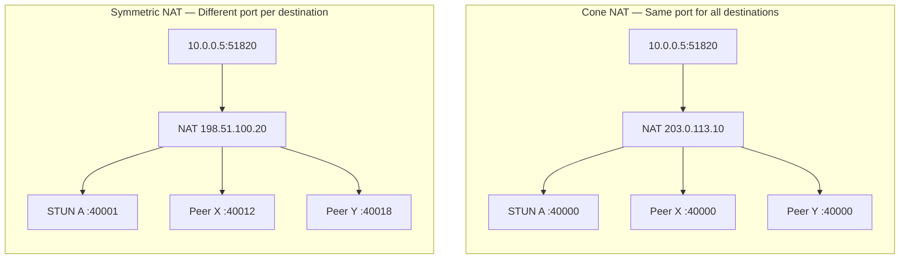

### 1.1 Cone NAT

**Characteristic**: The same internal socket (IP:Port) uses the **same mapped port** for **all external destinations**.

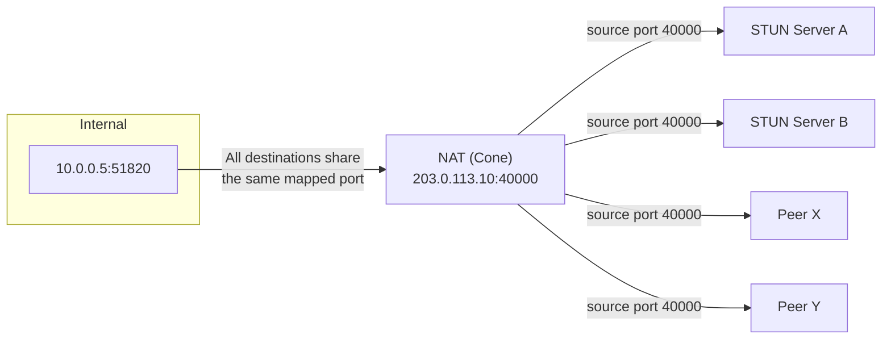

**Traversal advantage**: The mapped port is fixed and predictable. The peer only needs to know one public address to connect directly.

Cone NAT can be further classified into three subtypes (rustp2p does not differentiate; all are treated as Cone):

| Subtype | Inbound packet admission rule | Traversal difficulty |
|---------|------------------------------|---------------------|
| Full Cone | Any source IP allowed | Easiest |
| Restricted Cone | Source IP must match a previously contacted IP | Easy |
| Port Restricted Cone | Source IP + source port must both match | Harder |

### 1.2 Symmetric NAT

**Characteristic**: The same internal socket assigns **different mapped ports** for **different external destinations**.

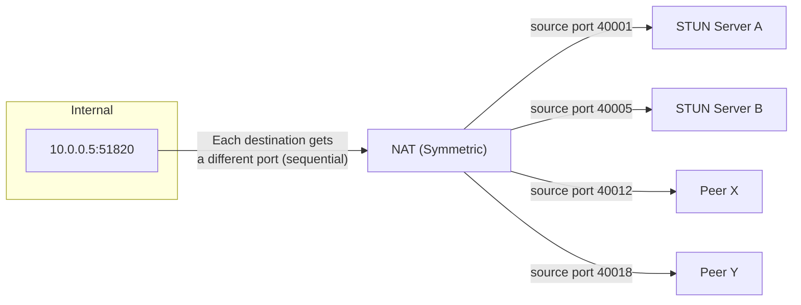

**Traversal challenge**: The peer cannot predict which port the Symmetric NAT will assign for its connection. Port prediction ("guessing") is required.

---

## 2. Core Principle: Why Hole Punching Works

### 2.1 The Essence of Hole Punching

The core principle of UDP hole punching: **Both peers simultaneously send packets to each other, each creating an outbound mapping on their own NAT. This mapping allows the other peer's inbound packets to pass through.**

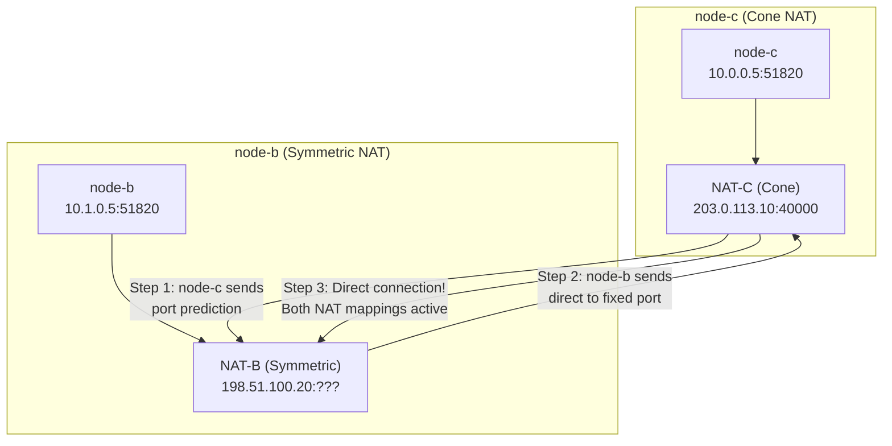

As shown in the Mermaid diagram above, the simultaneous bidirectional flow works as follows:

1. **Step 1**: node-c sends packets to node-b's public IP (port prediction) — node-c's NAT creates a mapping allowing inbound from 198.51.100.20
2. **Step 2**: node-b sends packets to node-c's public address (Cone port is fixed) — node-b's Symmetric NAT assigns a new port for this destination
3. **Step 3**: Packet arrives at node-c's NAT, source IP matches the existing mapping → admitted!
4. **Result**: Direct connection established between both peers

### 2.2 Why Simultaneous Bidirectional Punching Is Required

Unidirectional packet sending is not enough. If only node-b sends to node-c, and node-c has never sent a packet to node-b:

- If node-c is behind **Restricted Cone NAT**: node-c's NAT will reject the packet (no outbound record for 198.51.100.20)
- If node-c is behind **Port Restricted Cone NAT**: Even stricter — the port must also match

Only when node-c **also sends packets to node-b's IP** will node-c's NAT create an admission rule allowing inbound packets from that IP.

**This is why rustp2p performs hole punching bidirectionally and simultaneously** — each peer opens a "hole" in the other's NAT.

---

## 3. NAT Type Combinations and Punching Strategies

Different NAT type combinations have different success rates:

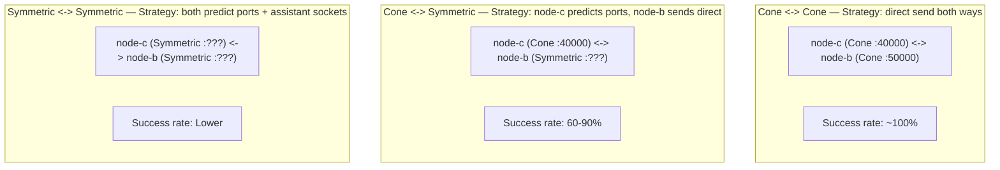

### 3.1 Cone <-> Cone (Easiest)

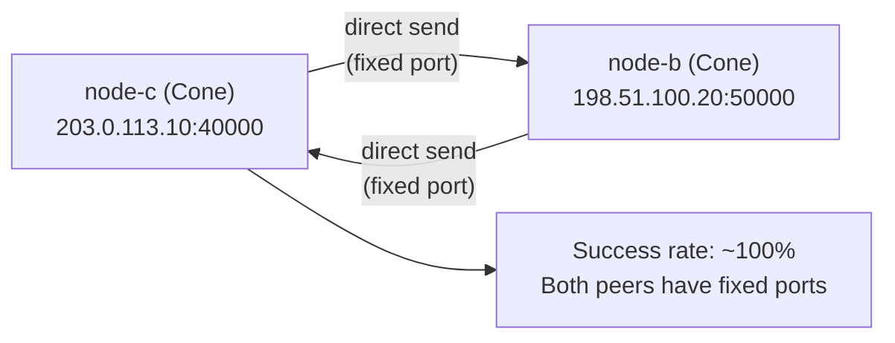

---

## 4. Complete rustp2p Hole Punching Workflow

### 4.1 Overall Architecture

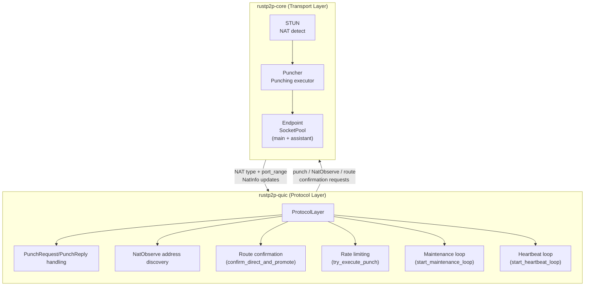

### 4.2 Phase 1: NAT Type Detection

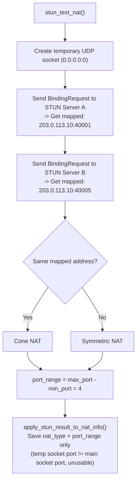

> **Key Design**: STUN detection uses a temporary socket (`0.0.0.0:0`), whose mapped port
> differs from the main QUIC socket's port. Therefore, STUN results are **only used for NAT
> type classification and port range estimation**. Real public IP/port is discovered via NatObserve.

### 4.3 Phase 2: Public Address Discovery (NatObserve)

NatObserve leverages existing direct QUIC connections to a publicly reachable node (e.g. the relay node-a)
to let that node observe and report your actual source address as seen from the internet.
Both node-b and node-c must each contact a public node independently — they cannot observe each other
because no hole has been punched between them yet.

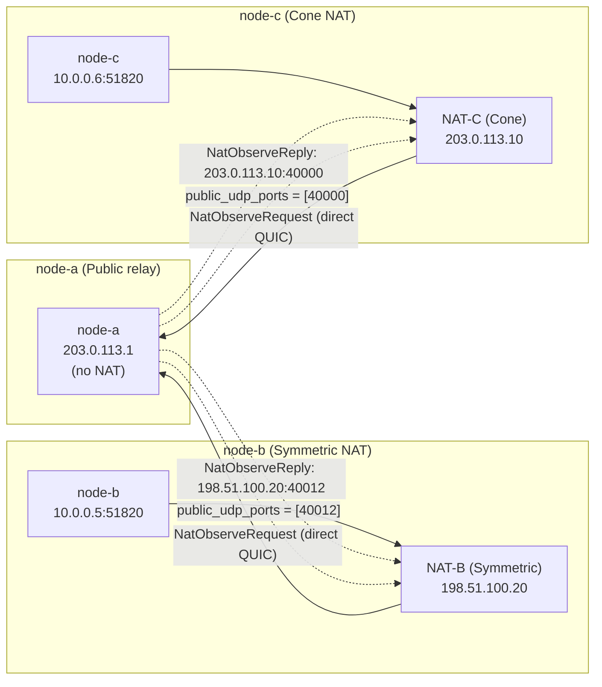

> **Note**: node-b's port 40012 is the mapping for the node-b → node-a direction.
> Under Symmetric NAT, sending to a different destination (node-c) will produce a different
> mapped port — this is what Phase 1 range-prediction is designed to compensate for.

### 4.4 Phase 3: Endpoint Configuration (Assistant Sockets)

Dynamically adjust the socket pool based on NAT type:

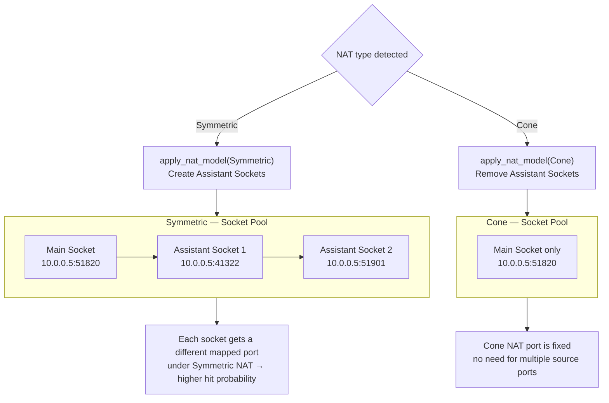

### 4.5 Phase 4: Hole Punching Execution

#### 4.5.1 Punching Triggers

Hole punching is triggered in three ways:

```
Trigger 1: Auto-punch loop (start_maintenance_loop, every 10s/peer)
  -> Automatically initiates punching for peers without direct routes

Trigger 2: Triggered upon receiving PunchRequest/PunchReply
  -> try_execute_punch (with rate limiting and address injection)

Trigger 3: Application-layer explicit call
  -> protocol.punch(peer_id)
```

#### 4.5.2 UDP Punching Strategy

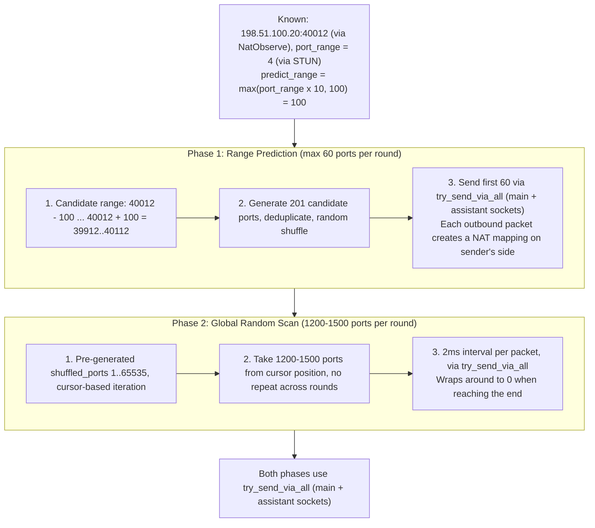

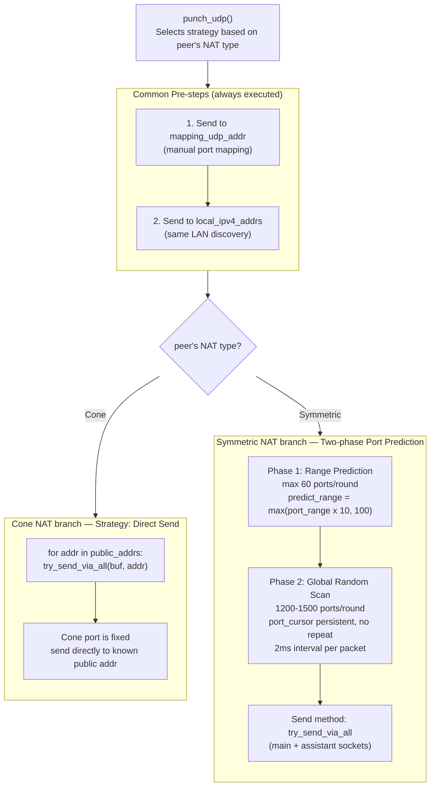

#### 4.5.3 Symmetric NAT Port Prediction in Detail

```
Assume peer (Symmetric NAT) known info:
  public_ips = [198.51.100.20]
  public_udp_ports = [40012]  (one mapped port obtained via NatObserve)
  port_range = 4  (port variation range detected by STUN)

Phase 1 Prediction:
  predict_range = max(4 x 10, 100) = 100
  Candidate port range: [40012 - 100, 40012 + 100] = [39912, 40112]
  -> Generate 201 candidate ports
  -> Deduplicate + random shuffle
  -> Send to first 60
  -> Each port sent via main + assistant sockets

Phase 2 Global Scan:
  Start from shuffled_ports[0], take 1200-1500 random ports
  Next round continues from where the last round ended (port_cursor)
  Wrap around to 0 when reaching the end
```

> **Why multiply predict_range by 10?** Because the peer has multiple sockets (main + assistant),
> each with independent port allocation under Symmetric NAT. The port difference between different
> sockets may be much larger than the port difference for a single socket across different destinations.

### 4.6 Phase 5: Route Confirmation

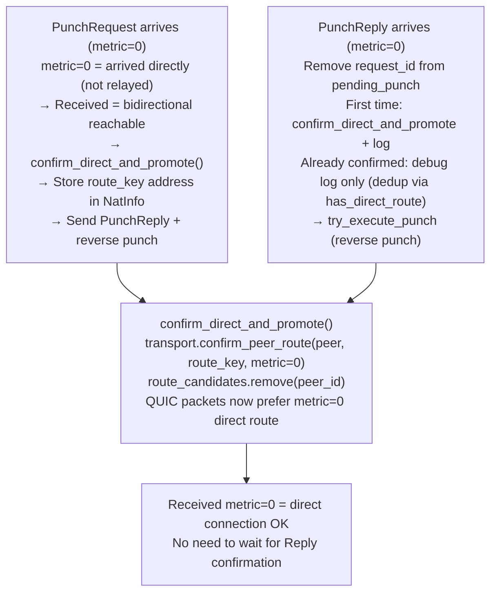

#### Why Can PunchRequest (metric=0) Directly Confirm Direct Connection?

This is a reliable inference based on NAT mapping principles:

```
node-b sends PunchRequest -> node-c

  1. Packet leaves node-b's socket, passes through node-b's NAT
  2. Packet traverses the public internet to node-c's NAT
  3. node-c's NAT admits it (because node-c also sent packets to node-b,
     so the mapping already exists)
  4. Packet arrives at node-c's socket

  Receiving a metric=0 packet = node-b can send to node-c = node-c can reply to node-b
  (because node-c's NAT mapping already allows traffic in this direction)

  Therefore: Received = bidirectional reachable = direct connection successful
```

---

## 5. Key Mechanisms in Detail

### 5.1 Assistant Socket

#### Assistant Socket — Bidirectional Simultaneous Punching

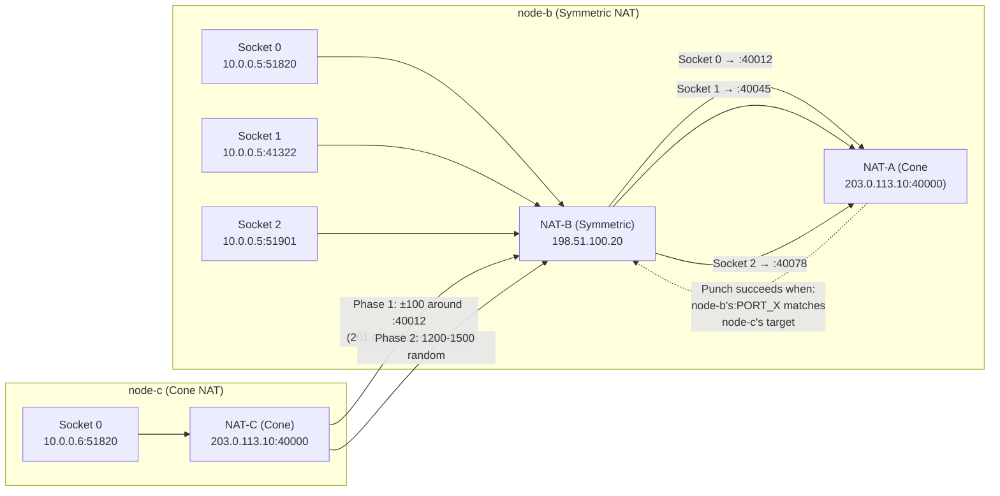

### 5.2 Direct Address Injection

When a PunchRequest arrives via a direct route (metric=0), the source address in route_key is more accurate than the public address in the peer's NatInfo:

```
Problem scenario:
  node-c learned node-b's address via NatObserve: 198.51.100.20:40012
  But 40012 is the mapped port for node-b's connection to the NatObserve relay node

  When node-b directly sends a PunchRequest to node-c:
    node-b's NAT assigns a new port for the node-c destination: 40035
    -> route_key address is 198.51.100.20:40035 (more accurate!)

  try_execute_punch injects:
    nat_info.public_ips = [198.51.100.20]
    nat_info.public_udp_ports = [40012, 40035]  <- inject route_key port

  -> Phase 1 prediction now covers ranges around both 40012 and 40035
  -> Higher hit probability
```

### 5.3 Rate Limiting and Backoff

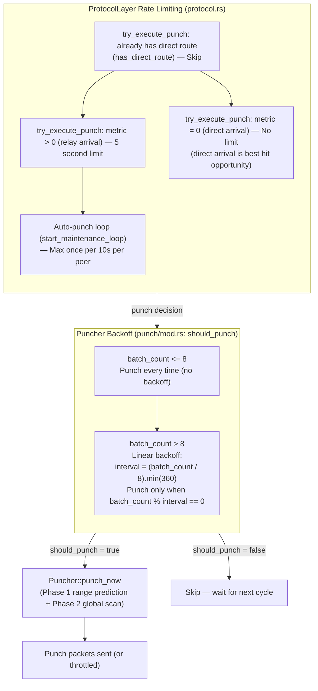

> **Note on backoff type**: The backoff is **linear**, not exponential. The formula is
> `interval = (batch_count / 8).min(360)`, capped at 360 seconds (6 minutes). The first 8
> punches fire every cycle; thereafter the interval grows linearly with the punch count.

### 5.4 NatObserve Address vs Actual Punching Address

```text
Address observed by node-b via node-a (relay):
  198.51.100.20:40012  (this is the mapped port for node-b -> node-a direction)

Address assigned when node-b directly punches to node-c:
  198.51.100.20:40035  (this is the mapped port for node-b -> node-c direction)

Why are they different?
  Symmetric NAT assigns different ports for different destinations
  node-a and node-c are different destinations -> different ports

  40012 != 40035, but usually within a similar range (determined by port_range)
  Phase 1 prediction covers port ranges around both -> can still hit
```

---

## 6. Complete Example Scenario

### Scenario: Three-Node Network (node-a relay + node-b/node-c punching)

```
Network topology:
  node-a: Public server 203.0.113.1 (no NAT, acts as relay)
  node-b: Symmetric NAT, public IP 198.51.100.20
  node-c: Cone NAT, public IP 203.0.113.10
```

#### Step 1: Initial Connection (via relay)

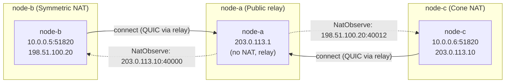

> **NatObserve exchange**: node-c observes node-b's source as `198.51.100.20:40012`; node-b observes node-c's source as `203.0.113.10:40000`. These are direction-specific mappings through the relay.

#### Step 2: Auto-Punch Trigger

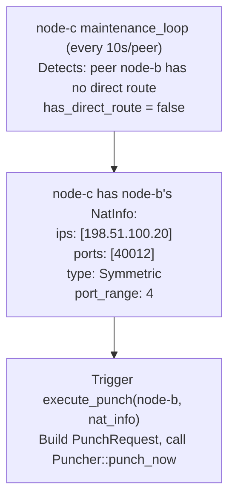

#### Step 3: node-c Executes Punching (sends to node-b)

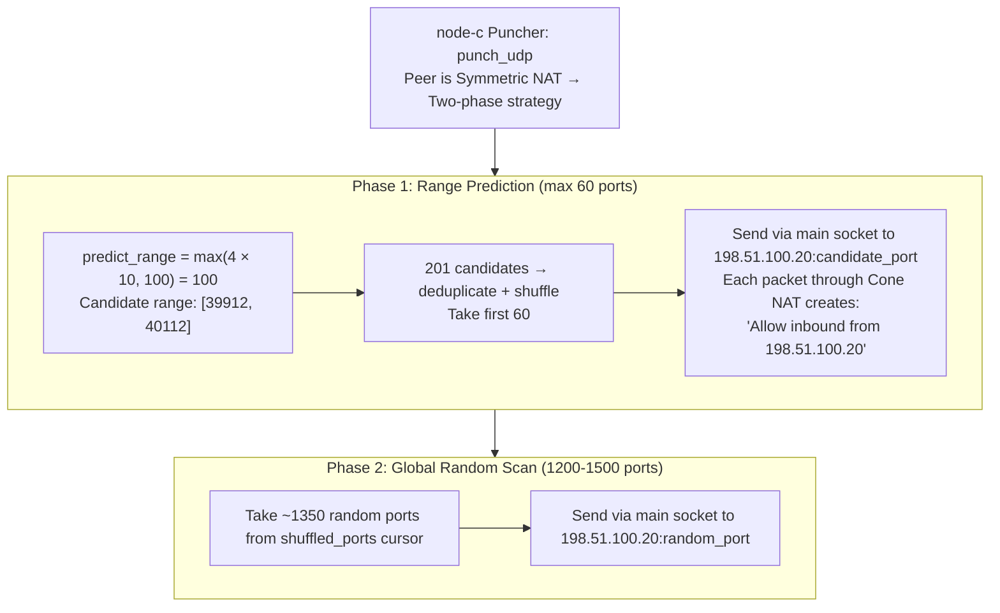

#### Step 4: node-b Executes Punching (sends to node-c)

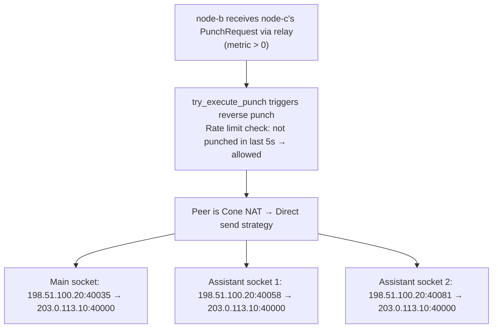

#### Step 5: Direct Connection Success

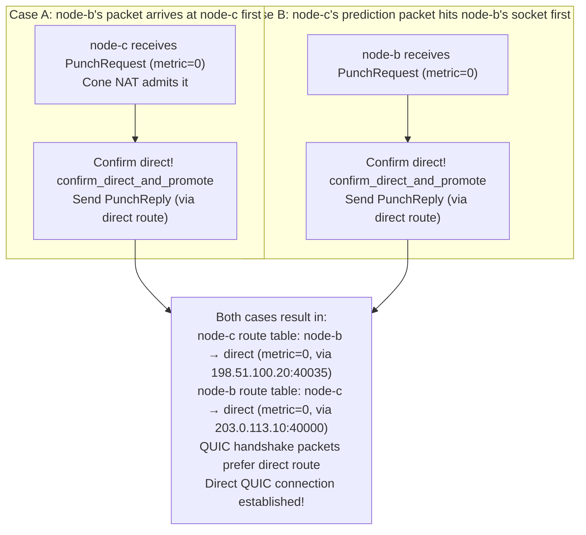

---

## 7. Direct Connection Health Check

### 7.1 Implemented Mechanism Overview

The health check mechanism has been implemented with three key components: heartbeat with RTT measurement, NAT mapping keepalive, and route idle eviction via IdleRouteManager.

```mermaid
flowchart TD
    HB["Heartbeat loop (start_heartbeat_loop, every 15s)<br/>Finds all peers with direct routes -> sends EchoRequest (8-byte timestamp)<br/>via direct route_key. Packets traverse UDP socket -> refreshes NAT mapping"]
    HB -->|EchoRequest via direct route_key| PEER
    PEER["Peer receives EchoRequest -> sends EchoReply (echoes back original timestamp)<br/>Also calls confirm_tcp_route() to ensure direct route is registered"]
    PEER -->|EchoReply, metric=0| RTT
    RTT["EchoReply handler: RTT calculation<br/>rtt = now_millis() - sent_timestamp (discards replies older than 60s)<br/>-> transport.update_route_rtt(peer, route_key, rtt)"]
    RTT -->|updates route| TBL
    TBL["RouteTable::update_rtt()<br/>Updates Route.rtt for the specific route_key<br/>If LoadBalance::LowestLatency -> re-sorts routes by RTT"]
    TBL -->|if no read activity| IDLE
    IDLE["Route idle -> IdleRouteManager detects read-idle timeout<br/>-> remove_route() evicts stale route -> maintenance loop detects gap -> re-punch"]
```

### 7.2 Heartbeat + RTT Measurement

The heartbeat loop (`start_heartbeat_loop`) runs every **15 seconds** and sends `EchoRequest` to all peers that have at least one direct route (metric=0):

```
start_heartbeat_loop (every 15s):
  1. Collect all peers with direct routes (known_peers + routes filter is_direct)
  2. For each peer:
     a. Generate timestamp = now_millis()
     b. Store in pending_echo[peer_id] = timestamp
     c. Send EchoRequest with 8-byte big-endian timestamp payload
        via the direct route_key (send_protocol_to_route)
```

When the peer receives `EchoRequest`, it:
1. Calls `confirm_tcp_route()` to ensure the direct route is registered
2. Sends `EchoReply` back with the original timestamp payload

When `EchoReply` arrives (metric=0):
1. Extracts the sent timestamp from the 8-byte payload
2. Calculates `rtt = now_millis() - sent_timestamp`
3. Discards stale replies (older than 60 seconds)
4. Calls `transport.update_route_rtt(peer, route_key, rtt)` to update the route table
5. Logs RTT changes only when the delta exceeds 10ms (to avoid log spam)

### 7.3 NAT Mapping Keepalive

The heartbeat mechanism serves a dual purpose:

| Purpose | How it works |
|---------|-------------|
| **RTT measurement** | EchoReply carries back the original timestamp, enabling RTT calculation |
| **NAT keepalive** | EchoRequest packets are sent via the direct UDP route, refreshing NAT mappings on both sides every 15 seconds |
| **Route liveness** | Receiving EchoReply proves the direct route is still functional |
| **LowestLatency routing** | Updated RTT values enable proper route sorting when using `LoadBalance::LowestLatency` |

The 15-second interval is well below typical NAT mapping aging times (30-120 seconds), ensuring mappings stay alive during idle periods.

Additional indirect keepalive mechanisms:
- **NatObserveRequest** (every 10s): Sent to direct peers via QUIC datagram
- **Quinn internal PING frames**: Default behavior sends PING frames when idle (~30s timeout)
- **Application-layer data**: Continuous data transmission naturally keeps mappings active

### 7.4 Route Lifecycle and Idle Eviction

#### 7.4.1 Why Connection Drop Does NOT Remove Routes

The QUIC application-layer connection lifecycle is **deliberately separated** from the
underlying UDP/TCP path lifecycle. When a QUIC connection drops (idle timeout, local close,
etc.), the NAT mapping and the physical path may still be alive. Therefore,
`cleanup_connection` **intentionally does not touch the route table**:

```rust
fn cleanup_connection(&self, stable_id: usize, peer_id: Option<PeerId>) {
    self.connection_tasks.remove(&stable_id);
    if let Some(peer_id) = peer_id {
        // Only remove the cache entry if it still points to *this*
        // connection. A newer connection may have already replaced it.
        let removed = self
            .connections
            .remove_if(&peer_id, |_, conn| conn.quinn().stable_id() == stable_id);
        if removed.is_some() {
            self.socket.release_virtual_peer(&peer_id);
        }
        // Intentionally do NOT remove direct routes here.
        //
        // QUIC application-layer connection lifecycle is separate from
        // the underlying UDP/TCP path. The route table has its own read-idle
        // detection (IdleRouteManager) and heartbeat-driven activity refresh,
        // which are the correct mechanisms for route lifecycle.
    }
}
```

What `cleanup_connection` actually does:
1. Removes the connection task handle from `connection_tasks`
2. Removes the QUIC connection from `connections` **only if** it still points to the same connection (prevents removing a newer replacement)
3. Releases the virtual peer socket binding via `release_virtual_peer`

#### 7.4.2 IdleRouteManager — The Real Route Lifecycle Manager

Route eviction is handled by `IdleRouteManager` in `rustp2p-core`, which monitors read-idle
timeouts independently of QUIC connection state:

```mermaid
flowchart TD
    subgraph IRM["IdleRouteManager (rustp2p-core/src/idle.rs)"]
        direction TB
        RI["read_idle: Duration<br/>(configured idle threshold)"]
        RT["route_table: RouteTable&lt;PeerID&gt;<br/>(shared with TransportLayer)"]
        NI["next_idle() —&gt; (PeerID, Route, Instant)<br/>Returns the next route whose last-read time exceeds read_idle<br/>Called by the maintenance loop to detect stale routes"]
        DL["delay(peer_id, route_key) —&gt; bool<br/>Pushes the route's read deadline forward (resets idle timer)<br/>Called when any traffic arrives on this route"]
        RM["remove_route(peer_id, route_key)<br/>Evicts a single stale route from the route table<br/>This is what triggers re-punching"]
        RI --> NI
        RI --> DL
        RI --> RM
    end

    IDLE["IdleRouteManager detects route with no read activity<br/>for &gt; read_idle (via next_idle)"]
    IDLE --> RM

    CHECK{"Was it the last direct route?"}
    RM --> CHECK
    CHECK -->|"Yes"| GD["has_direct_route(peer_id) = false"]
    CHECK -->|"No"| PRES["Relay/other routes preserved as fallback"]
    GD --> MAINT["Maintenance loop detects gap (next 10s cycle)"]
    MAINT --> RATE{"Rate limit check<br/>(should_punch / try_execute_punch)"}
    RATE -->|"Allowed"| PUNCH["Auto-punch triggered<br/>(execute_punch → Puncher::punch_now)"]
    RATE -->|"Limited"| SKIP["Skipped — waiting for next cycle"]
    PRES --> MAINT
```

#### 7.4.3 Heartbeat Keeps Active Routes Alive

The heartbeat loop (Section 7.2) serves a dual role here: every `EchoRequest` /
`EchoReply` exchange calls `update_read_time()`, which in turn calls
`IdleRouteManager::delay()`, pushing the route's idle deadline forward. This means:

- **Active routes with working heartbeat** → never evicted (idle timer constantly refreshed)
- **Routes where heartbeat stops arriving** → NAT mapping likely dead → idle eviction → re-punch

### 7.5 Summary

| Mechanism | Status | Implementation |
|-----------|--------|----------------|
| Heartbeat / Keepalive | **Implemented** | `start_heartbeat_loop` sends EchoRequest every 15s to direct peers |
| RTT measurement | **Implemented** | EchoReply handler calculates RTT, calls `update_route_rtt()` |
| NAT mapping keepalive | **Implemented** | Heartbeat packets traverse UDP socket, refreshing NAT mappings |
| Route idle eviction | **Implemented** | `IdleRouteManager` monitors read-idle timeout, evicts stale routes via `remove_route()` |
| Route read-time refresh | **Implemented** | Heartbeat exchange calls `update_read_time()` → `IdleRouteManager::delay()` |
| Connection cleanup (cache only) | **Implemented** | `cleanup_connection` removes QUIC connection cache + virtual peer, **preserves route table** |
| Route table RTT sorting | **Implemented** | `update_rtt()` re-sorts routes when `LoadBalance::LowestLatency` is active |
| Per-route QUIC connections | **Implemented** | `VirtualPeer.route_key` binding + `via_connections` + `send_to_via` / `try_send_to_via` / `open_bi_via` API |

### 7.6 Per-Route QUIC Connections

```mermaid
flowchart TB
    REG["VirtualPeer registration<br/>register_virtual_peer_via(peer, route_key)<br/>-> allocates synthetic address 127.0.0.1:9999<br/>-> VirtualPeer: peer_id, route_key Some(rk)<br/>-> via_virtual_addrs[(peer, rk)] = addr"]
    QUI["Quinn endpoint binds to synthetic addr<br/>Quinn thinks it sends to 127.0.0.1:9999<br/>QuicPeerSocket::try_send intercepts:<br/>-> finds VirtualPeer by destination addr<br/>-> route_key=Some -> try_send_quic_payload_via"]
    BYP["try_send_quic_payload_via bypasses the route table<br/>Wraps payload as QuicRelay packet<br/>-> try_send_wire_to_route(route_key) -> direct UDP send"]
    DEF["Default connection, route_key=None<br/>Uses route table default (lowest metric)<br/>try_send_quic_payload -> route table lookup"]
    VIA["Via connection, route_key=Some<br/>Bypasses route table entirely<br/>try_send_quic_payload_via -> direct wire send"]

    REG -->|binds| QUI
    QUI --> BYP
    BYP --> DEF
    BYP --> VIA
```

The per-route QUIC mechanism allows applications to open a dedicated QUIC connection over a
**specific route** (e.g., a particular direct path or relay path), bypassing the route table's
default selection.

#### How It Works

The mechanism is built on **synthetic address binding**:

```mermaid
flowchart TD
    APP["Application calls<br/>endpoint.open_bi_via(peer_id, route_key)"]
    CONN["QuicEndpoint::connection_to_via(peer_id, route_key)"]
    REG["register_virtual_peer_via(peer_id, route_key)<br/>— Allocates synthetic SocketAddr (e.g. 127.0.0.1:XXXX)<br/>— Creates VirtualPeer { peer_id, route_key: Some(route_key) }<br/>— Stores in via_virtual_addrs[(peer_id, route_key)]"]
    QUINN["Quinn Endpoint connects to the synthetic address<br/>All QUIC packets (handshake, stream data, datagrams, ACKs)<br/>go through QuicPeerSocket::try_send"]
    LOOKUP["try_send looks up VirtualPeer by destination address"]
    CHECK{"route_key is Some?"}
    VIA2["try_send_quic_payload_via()<br/>Wraps payload as QuicRelay Packet<br/>Calls transport.try_send_wire_to_route(route_key)<br/>Sends directly on the specified UDP/TCP path"]
    DEFAULT2["try_send_quic_payload()<br/>Route table lookup (default path)"]

    APP --> CONN
    CONN --> REG
    REG --> QUINN
    QUINN --> LOOKUP
    LOOKUP --> CHECK
    CHECK -->|"Yes — via connection"| VIA2
    CHECK -->|"No — default connection"| DEFAULT2
```

#### Key Data Structures

```
VirtualPeer {
    peer_id: PeerId,
    route_key: Option<RouteKey>,   // None = default, Some = pinned to route
}

QuicPeerSocket {
    virtual_by_addr:  DashMap<SocketAddr, VirtualPeer>,        // synthetic addr -> peer
    virtual_by_peer:  DashMap<PeerId, SocketAddr>,              // peer -> default synthetic addr
    via_virtual_addrs: DashMap<(PeerId, RouteKey), SocketAddr>, // per-route synthetic addr
}
```

#### Public API

| Method | Layer | Description |
|--------|-------|-------------|
| `send_to_via(peer_id, route_key, payload)` | `QuicEndpoint` | Send a datagram over a specific route (async, may await connection) |
| `try_send_to_via(peer_id, route_key, payload)` | `QuicEndpoint` | Non-blocking variant of `send_to_via` |
| `open_bi_via(peer_id, route_key)` | `QuicEndpoint` | Open a bidirectional stream over a specific route |
| `connection_to_via(peer_id, route_key)` | `QuicEndpoint` (internal) | Get/create per-route QUIC connection |

#### Connection Lifecycle

Per-route QUIC connections are cached in `via_connections: DashMap<(PeerId, RouteKey), Connection>`.
When a per-route connection drops:

```rust
fn cleanup_via_connection(&self, stable_id: usize, peer_id: Option<PeerId>, route_key: RouteKey) {
    self.connection_tasks.remove(&stable_id);
    if let Some(peer_id) = peer_id {
        let key = (peer_id.clone(), route_key);
        let removed = self
            .via_connections
            .remove_if(&key, |_, conn| conn.quinn().stable_id() == stable_id);
        if removed.is_some() {
            self.socket.release_virtual_peer_via(&peer_id, &route_key);
        }
    }
}
```

Similar to the default connection cleanup, **routes are not removed** — only the per-route
connection cache and synthetic address binding are released. The route remains in the route
table and can be reused by calling `send_to_via` / `open_bi_via` again.

#### Obtaining RouteKeys

Applications obtain `RouteKey` values from the route table:

```rust
let routes: Vec<Route> = endpoint.routes(&peer_id)?;
// Each Route has .route_key() and .metric()
// Filter for direct routes (metric == 0) or relay routes as needed
let direct_route_key = routes
    .into_iter()
    .find(|r| r.is_direct())
    .map(|r| r.route_key());
```

#### Behavior by NAT Type and Route Type

The per-route QUIC APIs (`send_to_via`, `try_send_to_via`, `open_bi_via`) operate
on any `RouteKey` found in the route table, but their success probability,
latency, and failure modes differ depending on the **local** and **remote**
peer's NAT classification. The table and matrix below describe these differences.

##### Public API Reference

| Method | Layer | Signature | Blocking? | Behavior by Route Type |
|--------|-------|-----------|-----------|----------------------|
| `send_to_via` | `QuicEndpoint` | `async send_to_via(peer_id, route_key, payload) -> Result<()>` | Yes — awaits connection handshake + datagram send | **Direct route:** QUIC handshake traverses direct path (NAT punch-through). **Relay route:** handshake packets wrapped as QuicRelay packets and forwarded hop-by-hop. Always creates/reuses connection. |
| `try_send_to_via` | `QuicEndpoint` | `try_send_to_via(peer_id, route_key, payload) -> Result<()>` | No — returns `WouldBlock` if no cached connection | **Both route types:** sends over existing per-route QUIC connection. No handshake; caller must have called `send_to_via` or `open_bi_via` first to establish the connection. |
| `open_bi_via` | `QuicEndpoint` | `async open_bi_via(peer_id, route_key) -> Result<stream, stream>` | Yes — awaits connection establishment + stream open | **Direct route:** QUIC handshake + stream open over direct path. **Relay route:** handshake + stream data wrapped as QuicRelay and forwarded. Retries once after 50ms on failure (clears stale connection cache). |

##### NAT Type × Route Type Behavior Matrix

| Local NAT →<br>Remote NAT ↓ | **Cone → Cone**<br>(direct route) | **Cone → Symmetric**<br>(direct route) | **Symmetric → Cone**<br>(direct route) | **Symmetric → Symmetric**<br>(likely no direct route) | **Any → Any** (relay route) |
|---------------------------|:---------------------------------:|:--------------------------------------:|:---------------------------------------:|:-----------------------------------------------------:|:---------------------------:|
| **Cone NAT** | ✅ Handshake succeeds quickly (1 RTT). Port mapping stable. `try_send_via` cache reliable. | ✅ Handshake succeeds if remote's predicted port hits (Symmetric → Cone is single-direction prediction). Mapping may shift. | ⚠️ Requires bidirectional port prediction. Handshake may fail if local port mapping drifts. `send_to_via` may need multiple attempts. | ❌ Direct route rarely exists. `routes()` returns only relay routes. Must use relay route_key. | ✅ Handshake succeeds (relay provides traversal). RTT = 2 relay hops. `try_send_to_via` cache stable (relay is persistent). |
| **Symmetric NAT** | ✅ Same as Cone → Cone but local uses assistant sockets for port prediction. Handshake reliable once port is found. | ⚠️ Both sides need port prediction. Handshake success depends on prediction range overlap. `open_bi_via` retry(50ms) helps. | ⚠️ Same as above. Local uses assistant socket pool (`try_send_via_all` over all assistants). Success rate depends on port_range width. | ❌ Direct route almost never established. `routes()` returns only relay. Use relay route_key. | ✅ Same as above. Assistant sockets still used for the relay leg (to the relay node). |

##### Key Observations

1. **Direct routes (metric=0)**: The `route_key` addresses the remote peer's
   public address directly. NAT behavior depends entirely on whether the
   NAT mappings on both sides are alive and predictable:
   - **Cone NAT**: Single port mapping per (src_ip, src_port, dest_ip, dest_port).
     Once established, the mapping is stable for the lifetime of the outbound
     packet flow. `try_send_to_via` cache is highly reliable.
   - **Symmetric NAT**: New port mapping per (src_ip, src_port, dest_ip, dest_port)
     tuple. The mapping can shift between sends if the NAT assigns a different
     port. This makes `try_send_to_via` cache less reliable — if the NAT mapping
     has been reallocated, the cached QUIC connection's path becomes stale and
     the next `try_send_to_via` returns `ConnectionLost` (not `WouldBlock`).
     The application must call `send_to_via` to re-establish.

2. **Relay routes (metric>0)**: The `route_key` addresses the next-hop relay
   node's address. The relay forwards packets to the destination. This path
   is **NAT-independent** — the relay is a public node that can always receive
   inbound traffic. `try_send_to_via` cache is stable because the relay leg is
   persistent. However, RTT is higher (minimum 2 hops) and the relay node must
   be operational.

3. **`open_bi_via` retry**: The 50ms retry with cache cleanup handles transient
   failures (e.g., NAT mapping expiry during handshake). This is most relevant
   for Symmetric NAT scenarios where port mappings can shift mid-handshake.

4. **`try_send_to_via` vs `WouldBlock`**: `WouldBlock` indicates no cached
   connection exists (connection was never opened). For Symmetric NAT, a cached
   connection may also fail with `ConnectionLost` if the NAT mapping shifted —
   the application should catch this error and re-establish via `send_to_via`.

5. **Connection lifecycle by NAT type**: When a per-route QUIC connection drops:
   - **Cone NAT + direct route**: Re-establishing is fast (1 RTT, mapping stable).
   - **Symmetric NAT + direct route**: Re-establishing may require
     re-predicted port mapping; local node may allocate a new assistant socket.
   - **Relay route (any NAT)**: Re-establishing always succeeds if the relay
     is alive (NAT-independent path). Route is preserved in the route table.

6. **Selecting RouteKey by NAT type**: Applications should prefer direct routes
   (`metric == 0`) for lowest latency, but should gracefully fall back to relay
   routes when:
   - No direct route exists (common with Symmetric → Symmetric pairs)
   - The direct route's RTT exceeds a threshold
   - `try_send_to_via` returns `ConnectionLost` (NAT mapping expired)

```rust
// Recommended pattern for NAT-aware route selection:
let routes = endpoint.routes(&peer_id)?;
let chosen = routes.iter()
    .filter(|r| r.is_direct())  // prefer direct first
    .chain(routes.iter().filter(|r| !r.is_direct()))  // fallback to relay
    .find_map(|r| {
        // For Symmetric NAT, may want to skip direct if RTT is poor
        Some(r.route_key())
    });
```

## 8. Bootstrap Relay Punching Scenario and Backoff Analysis

> This section answers: **when both node-b and node-c are bootstrapped via the
> public relay node-a, how does the punching flow proceed, and does the system
> apply exponential backoff on repeated failure?**

### 8.1 Scenario Topology

Both node-b (Symmetric NAT) and node-c (Cone NAT) join the network by
bootstrapping through node-a (public server, no NAT). At startup they only have
a **relay route** (metric > 0) to each other through node-a — there is no direct
route yet. The goal is to create a direct (metric = 0) route via hole punching.

```mermaid
flowchart LR
    subgraph PUB["Public Internet"]
        NA["node-a (Public relay / bootstrap)<br/>203.0.113.1<br/>no NAT — directly reachable"]
    end

    subgraph NBN["node-b network (Symmetric NAT)"]
        direction TB
        NBI["node-b<br/>10.0.0.5:51820"]
        NBNAT["NAT-B (Symmetric)<br/>198.51.100.20<br/>port varies by destination"]
        NBI --> NBNAT
    end

    subgraph NCN["node-c network (Cone NAT)"]
        direction TB
        NCI["node-c<br/>10.0.0.6:51820"]
        NCNAT["NAT-C (Cone)<br/>203.0.113.10:40000<br/>port fixed for all destinations"]
        NCI --> NCNAT
    end

    NBNAT -->|"bootstrap (--relay node-a)<br/>relay route, metric > 0"| NA
    NCNAT -->|"bootstrap (--relay node-a)<br/>relay route, metric > 0"| NA

    NBNAT -.->|"target: direct route metric = 0"| NCNAT
```

Key points:
- node-a relays QUIC packets between node-b and node-c, but relayed delivery
  costs bandwidth and latency. Both peers aim to upgrade to a direct route.
- Bootstrap gives each peer the other's `PeerInfo`, but the **direct** path is not
  yet validated.

### 8.2 Five-Stage Punching Flow

```mermaid
flowchart TD
    subgraph S1["Stage 1: Bootstrap relay connection"]
        direction TB
        S1A["node-b starts with --relay node-a<br/>establishes QUIC connection to node-a"]
        S1B["node-c starts with --relay node-a<br/>establishes QUIC connection to node-a"]
        S1C["Result: both have relay routes to each other<br/>via node-a (metric > 0)"]
        S1A --> S1C
        S1B --> S1C
    end

    subgraph S2["Stage 2: Public address discovery (NatObserve)"]
        direction TB
        S2A["node-b sends NatObserveRequest to node-a"]
        S2B["node-c sends NatObserveRequest to node-a"]
        S2C["node-a observes source addresses:<br/>node-b -> 198.51.100.20:40012<br/>node-c -> 203.0.113.10:40000"]
        S2D["node-a replies NatObserveReply:<br/>node-b learns public_ips=[198.51.100.20], ports=[40012]<br/>node-c learns public_ips=[203.0.113.10], ports=[40000]"]
        S2A --> S2C
        S2B --> S2C
        S2C --> S2D
    end

    subgraph S3["Stage 3: Peer discovery + PunchRequest exchange"]
        direction TB
        S3A["Maintenance loop (1s tick) + QueryRoutes<br/>both learn the other peer exists"]
        S3B{"has_direct_route?<br/>peer has only metric > 0 relay route"}
        S3C["Auto-punch trigger (every 10s/peer):<br/>send PunchRequest via relay<br/>carrying own NatInfo"]
        S3D["Receive peer's PunchRequest<br/>-> store in peer_nat<br/>-> try_execute_punch (reverse punch)"]
        S3A --> S3B
        S3B -->|"No"| S3C
        S3C --> S3D
    end

    subgraph S4["Stage 4: Bidirectional hole punching"]
        direction TB
        S4A["node-b (Symmetric) punches node-c:<br/>Phase 1 range prediction<br/>+ Phase 2 global random scan"]
        S4B["node-c (Cone) punches node-b:<br/>direct send to 198.51.100.20:40012"]
        S4C["Both send simultaneously via<br/>try_send_via_all (main + assistant sockets)"]
        S4A --> S4C
        S4B --> S4C
    end

    subgraph S5["Stage 5: Hit -> confirm -> promote"]
        direction TB
        S5A["A punch reaches peer's open mapping<br/>PunchRequest/PunchReply arrives metric = 0"]
        S5B["confirm_direct_and_promote()<br/>confirm_peer_route(peer, route_key, metric=0)"]
        S5C["Route table updated:<br/>both directions direct (metric = 0)"]
        S5D["QUIC handshake prefers direct route<br/>direct P2P connection established"]
        S5A --> S5B --> S5C --> S5D
    end

    S1 --> S2 --> S3 --> S4 --> S5
```

Narrative:
- **Stage 1**: Both nodes create a relay QUIC path through node-a. The path is
  usable but requires node-a to forward every packet.
- **Stage 2**: Each node independently asks node-a to observe its own public
  address. Note the port learned (`40012`) is the mapping for the
  *node-b -> node-a* direction; punching node-c will use a different port
  (Symmetric NAT assigns different ports per destination).
- **Stage 3**: The 1s maintenance loop (plus `QueryRoutes`) lets both peers learn
  of each other. Even without NatInfo yet, a PunchRequest is sent via relay
  carrying the sender's own NatInfo — breaking the chicken-and-egg problem by
  giving the peer its observations anyway.
- **Stage 4**: On receiving the peer's PunchRequest, `try_execute_punch` triggers
  the reverse punch. node-b uses the Symmetric two-phase strategy, node-c uses
  the Cone direct-send strategy. Both fire simultaneously.
- **Stage 5**: Whichever packet hits first arrives with `metric == 0`, triggering
  `confirm_direct_and_promote`. Routes are upgraded to direct and QUIC traffic
  now prefers the direct path.

### 8.3 Backoff and Rate Limiting

**Direct answer to the user's question: punching uses a LINEAR backoff, not an
exponential backoff.**

Backoff is implemented in the `Puncher` layer via `should_punch()`
(`rustp2p-core/src/punch/mod.rs`). The interval is
`(batch_count / 8).min(360)` seconds — it grows one second every 8 executed
punches, capped at 360 s (6 min). The first 8 punches are executed every time
with no delay.

Two additional rate limits sit above it in the protocol layer.

```mermaid
flowchart TD
    subgraph L1["Layer 1: Maintenance loop (protocol.rs:1478)"]
        direction TB
        L1A["1s interval tick"]
        L1B{"now - last_punch_time < 10s?"}
        L1C["Skip"]
        L1D["Send PunchRequest + execute_punch"]
        L1A --> L1B
        L1B -->|"Yes"| L1C
        L1B -->|"No"| L1D
    end

    subgraph L2["Layer 2: PunchRequest handler (protocol.rs:1095)"]
        direction TB
        L2A{"metric > 0? (relay arrival)"}
        L2B{"now - last &lt; 5s?"}
        L2C["Skip execute_punch (relay rate limited)"]
        L2D["No limit (direct arrival)<br/>best-hit opportunity"]
        L2E{"has_direct_route?"}
        L2F["Skip entirely"]
        L2G["Proceed to Puncher::punch_now"]
        L2A -->|"Yes"| L2B
        L2B -->|"Yes"| L2C
        L2B -->|"No"| L2E
        L2A -->|"No (metric=0)"| L2D
        L2D --> L2E
        L2E -->|"Yes"| L2F
        L2E -->|"No"| L2G
    end

    subgraph L3["Layer 3: Puncher backoff (punch/mod.rs:45 should_punch)"]
        direction TB
        L3A{"batch_count <= 8?"}
        L3B["Punch immediately (no backoff)"]
        L3C{"interval = (batch_count / 8).min(360)<br/>elapsed >= interval?"}
        L3D["Punch now<br/>batch_count += 1"]
        L3E["Skip this round"]
        L3A -->|"Yes"| L3B
        L3A -->|"No"| L3C
        L3B --> L3D
        L3C -->|"Yes"| L3D
        L3C -->|"No"| L3E
    end

    L1D --> L2A
    L2G --> L3A
```

**Backoff value table** (from `should_punch()`):

| batch_count | interval (s) | meaning |
|-------------|--------------|---------|
| 1-8 | 0 (every time) | no backoff yet |
| 9-16 | 1 | punch about once/second |
| 17-24 | 2 | - |
| 32 | 4 | - |
| 64 | 8 | - |
| 128 | 16 | - |
| 256 | 32 | - |
| 512 | 64 | - |
| 1024 | 128 | - |
| 2048 | 256 | - |
| 2880+ | 360 (cap) | punch about once per 6 minutes |

Notes:
- `batch_count` increments inside `punch_now()` after each executed batch.
- The growth is **linear** (`batch_count / 8`), not exponential (`2^n`).
- The 360 s cap means even after prolonged failure the system still retries
  roughly every 6 minutes — it never fully gives up.
- Relay-arrived PunchRequests carry an extra 5 s limit (Layer 2); direct arrivals
  (`metric == 0`) bypass it because they are the best-hit opportunity.

### 8.4 Combined Effect of the Three Layers

| scenario | Layer 1 (loop) | Layer 2 (relay limit) | Layer 3 (backoff) | net effect |
|----------|---------------|----------------------|-------------------|-----------|
| first punches (batch<=8) | every 10s | 5s (no effect) | no delay | ~every 10s |
| mid-phase (batch=32) | every 10s | 5s | 4s (satisfied) | ~every 10s (Layer 1 is bottleneck) |
| late (batch=256) | every 10s | 5s | 32s | effectively ~every 32s (Layer 3 dominates) |
| direct arrival (metric=0) | - | unlimited | still subject to Layer 3 | best-hit path, skips Layer 2 |
| already connected | skip (metric=0) | has_direct_route skip | - | punching stops entirely |

Summary: Layers 1 and 2 throttle *trigger frequency*; Layer 3 throttles
*execution frequency*. For the first 8 punches the 10 s loop interval is the
bottleneck; later, the growing L3 interval dominates. The layering prevents
punching storms while never fully abandoning the attempt.

### 8.5 Behavior on Repeated Failure

1. **Flow**: bootstrap via node-a -> NatObserve public addresses -> maintenance
   loop discovers the peer and exchanges NatInfo -> simultaneous bidirectional
   punching (node-b Symmetric two-phase; node-c Cone direct) -> on hit the route
   is upgraded to metric = 0 direct.
2. **Backoff**: **not exponential**, but **linear**. The first 8 punches happen
   every ~10 s (driven by the maintenance loop); afterwards `should_punch()`
   grows the interval by `batch_count / 8`, capped at 360 s. Even after lengthy
   failure the system keeps retrying every 6 minutes instead of stopping.
3. **Recovery**: if the direct route is later evicted by `IdleRouteManager` (its
   mapping expires), the next 10 s maintenance cycle re-detects
   `has_direct_route == false` and automatically re-triggers the punching flow;
   `batch_count` keeps accumulating across cycles.

---

## Appendix: Key Code Location Index

| Function | File | Description |
|----------|------|-------------|
| NAT type definition | `rustp2p-core/src/nat/mod.rs` | NatType enum (Cone, Symmetric) |
| STUN detection | `rustp2p-core/src/stun/mod.rs` | `stun_test_nat()` — Cone/Symmetric classification, port_range extraction |
| punch_udp core | `rustp2p-core/src/punch/mod.rs` | Two-phase strategy: Cone direct send, Symmetric port prediction |
| apply_nat_model | `rustp2p-core/src/endpoint/service.rs` | Assistant socket creation for Symmetric NAT |
| try_send_via_all | `rustp2p-core/src/endpoint/pool.rs` | Send via main + all assistant sockets |
| PunchRequest handler | `rustp2p-quic/src/protocol.rs` | metric=0 immediate confirmation + address injection |
| PunchReply handler | `rustp2p-quic/src/protocol.rs` | Dedup via has_direct_route, confirm_direct_and_promote |
| try_execute_punch | `rustp2p-quic/src/protocol.rs` | Rate limiting: 5s for relay, unlimited for direct |
| confirm_direct_and_promote | `rustp2p-quic/src/protocol.rs` | Promotes route to metric=0 in route table |
| has_direct_route | `rustp2p-quic/src/protocol.rs` | Checks if any metric=0 route exists for peer |
| confirm_tcp_route | `rustp2p-quic/src/protocol.rs` | TCP metric=0 confirmation delegates to confirm_direct_and_promote |
| try_send_quic_payload | `rustp2p-quic/src/protocol.rs` | Route-table-based QUIC send (direct first, then via try_send_wire, then route_candidates) |
| try_send_quic_payload_via | `rustp2p-quic/src/protocol.rs` | Per-route QUIC send bypassing route table |
| route_metric_for | `rustp2p-quic/src/protocol.rs` | Returns route for QUIC receive when route may still be candidate |
| start_maintenance_loop | `rustp2p-quic/src/protocol.rs` | Auto-punch every 10s/peer, NatObserve, IDRouteQuery |
| start_heartbeat_loop | `rustp2p-quic/src/protocol.rs` | EchoRequest heartbeat every 15s, RTT measurement |
| EchoReply handler | `rustp2p-quic/src/protocol.rs` | RTT calculation, update_route_rtt() |
| cleanup_connection | `rustp2p-quic/src/quic.rs` | QUIC connection drop handler — releases cache + virtual peer only, **preserves route table** |
| cleanup_via_connection | `rustp2p-quic/src/quic.rs` | Per-route QUIC connection drop handler — releases via cache + synthetic addr, preserves route table |
| send_to_via / try_send_to_via | `rustp2p-quic/src/endpoint.rs` | Public per-route QUIC datagram send API |
| open_bi_via | `rustp2p-quic/src/endpoint.rs` | Public per-route QUIC bidirectional stream API |
| register_virtual_peer_via | `rustp2p-quic/src/quic.rs` | Allocates synthetic address bound to a RouteKey for per-route QUIC |
| routes | `rustp2p-quic/src/endpoint.rs` | Returns Vec<Route> for a peer, providing RouteKey values for via API |
| confirm_peer_route | `rustp2p-quic/src/transport.rs` | Confirms route in route table + updates PeerInfo (direct/relay) |
| update_route_rtt | `rustp2p-quic/src/transport.rs` | Calls RouteTable::update_rtt for RTT tracking |
| update_route_read_time | `rustp2p-quic/src/transport.rs` | Calls IdleRouteManager::delay to refresh idle timer |
| IdleRouteManager | `rustp2p-core/src/idle.rs` | Read-idle timeout detection — evicts stale routes via remove_route |
| IdleRouteManager::next_idle | `rustp2p-core/src/idle.rs` | Returns next route exceeding read_idle threshold |
| IdleRouteManager::remove_route | `rustp2p-core/src/idle.rs` | Evicts a stale route (triggers re-punch via maintenance loop) |
| RouteTable::remove_route | `rustp2p-core/src/route_table/table.rs` | Remove specific route by route_key from route table |
| RouteTable::update_rtt | `rustp2p-core/src/route_table/table.rs` | RTT update + LowestLatency re-sort |
| RouteKey | `rustp2p-core/src/route_table/mod.rs` | Protocol + SocketAddr, uniquely identifies a path |
| Route::is_direct | `rustp2p-core/src/route_table/table.rs` | Returns true if metric == 0 (direct route) |
| Route::is_relay | `rustp2p-core/src/route_table/table.rs` | Returns true if metric > 0 (relay route) |
| apply_stun_result_to_nat_info | `rustp2p-quic/src/protocol.rs` | Only saves nat_type + port_range from STUN |
| apply_observation_to_nat_info | `rustp2p-quic/src/protocol.rs` | Saves public_ips + public_udp_ports from NatObserve |
