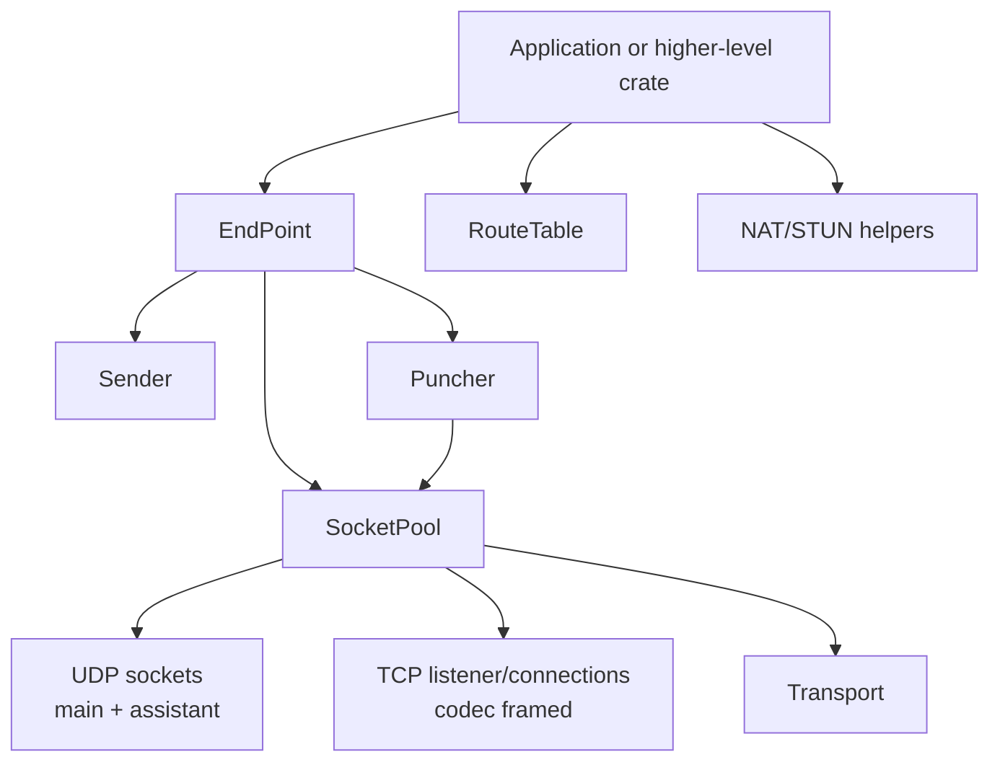

# rustp2p-core Design

This document describes the implemented `rustp2p-core` architecture. It is the
low-level transport and NAT traversal layer used by higher-level crates such as
`rustp2p-quic`.

`rustp2p-core` does not define a global peer identity model and does not encrypt
application payloads. Callers provide their own peer ids for `RouteTable<T>` and
their own application protocol on top of raw bytes.

## Architecture



The public entry point is `EndPoint`. Internally it owns a `SocketPool`, starts
UDP/TCP reader tasks, and receives bytes through one channel. `Sender` is a
cloneable handle for outbound operations. `Transport` is a send handle attached
to a received packet's source route.

## Endpoint And Socket Pool

`EndPoint::bind(Config)` creates:

- one main UDP socket when UDP is enabled;
- a TCP listener when TCP is enabled;
- reader tasks that forward incoming data as `(Transport, Bytes)`;
- a `Sender` and `Puncher` backed by the same socket pool.

TCP uses an `InitCodec` to frame bytes. The default codec is length-prefixed.
UDP packets are delivered as received.

`EndPoint::recv()` returns:

```rust
Received {
    data: Bytes,
    transport: Transport,
}
```

The returned `Transport` can reply to the same remote address and exposes its
`Protocol` and `SocketAddr`.

## Sender

`Sender` is intentionally narrower than `SocketPool`. It allows callers to send
and inspect socket state without exposing internal socket management.

Important operations:

- `send_to(buf, addr)`: send through the main UDP socket.
- `try_send_via_all(buf, addr)`: send through all UDP sockets.
- `send_via_assistants(buf, addr)`: send through assistant UDP sockets.
- `connect(addr)`: establish or reuse a TCP connection.
- `write_to(data, addr)`: write to a TCP connection.
- `local_addr()`, `assistant_count()`, `udp_sockets()`, `tcp_connections()`:
  read-only socket state queries.

Assistant sockets are implementation detail for symmetric NAT probing. They are
managed through `EndPoint::apply_nat_model`, not directly through `Sender`.

## Route Table

`RouteTable<T>` maps a caller-defined peer id to one or more `Route`s. A route is
identified by:

```text
RouteKey = Protocol + SocketAddr
```

Route metrics:

- `metric == 0`: direct route;
- `metric > 0`: relayed or multi-hop route according to the caller's protocol;
- `rtt`: route latency hint used by selection policies.

The route table stores route metadata only. It does not own sockets and does not
prove reachability by itself. Higher layers decide when a route is confirmed and
insert or remove it.

## NAT Information

`NatInfo` stores local and observed addressing metadata:

- `nat_type`: `Cone` or `Symmetric`;
- public IPv4 addresses and UDP/TCP ports;
- local IPv4 addresses and UDP/TCP ports;
- optional IPv6 address;
- configured mapping addresses;
- symmetric NAT public port range hints.

`EndPoint::nat_info()` runs STUN against explicitly configured servers. Default
configuration contains no STUN servers.

`EndPoint::apply_nat_model(nat_type)` does not run detection. It consumes the
local NAT type supplied by the caller:

- `Symmetric`: add assistant UDP sockets up to `max_assistant_sockets`;
- `Cone`: clean assistant UDP sockets.

This keeps NAT detection policy outside the socket model mutation API.

## Punching

`Puncher` performs low-level UDP/TCP hole-punching attempts using remote
`NatInfo` supplied through `PunchInfo`.

The local NAT model is not selected by `Puncher`. Higher layers should:

1. detect or learn the local `NatType`;
2. call `EndPoint::apply_nat_model(local_nat_type)`;
3. exchange `NatInfo` with the remote peer using their own protocol;
4. call `Puncher::punch` or `Puncher::punch_now` with remote `NatInfo`.

`Puncher::need_punch` applies backoff based on previous attempts to the same
remote NAT address.

## Data Flow

### Receive

```text
UDP/TCP socket
  -> SocketPool reader task
  -> EndPoint internal channel
  -> EndPoint::recv()
  -> Received { data, transport }
```

### Send

```text
Sender::send_to / Transport::send / Sender::write_to
  -> SocketPool
  -> UDP socket or TCP connection
  -> network
```

### Route Use

```text
Received.transport
  -> RouteKey::from_transport()
  -> caller protocol confirms route
  -> RouteTable<T>::add_route(...)
  -> later send by selected RouteKey
```

`rustp2p-core` deliberately does not decide whether receiving a packet confirms
bidirectional reachability. That decision belongs to the caller's protocol.

## Defaults

- UDP and TCP default to port `0` unless configured.
- STUN server list defaults to empty.
- `max_assistant_sockets` defaults to `0`.
- Load balancing defaults to `MinHopLowestLatency`.
- Internal logs are debug-level unless a warning indicates a send, socket, or
  protocol problem.

## Relationship To rustp2p-quic

`rustp2p-quic` builds a PeerId QUIC overlay above this crate:

- `rustp2p-core` sends and receives raw bytes over UDP/TCP.
- `rustp2p-quic` defines the peer identity, protocol packets, discovery, relay,
  and end-to-end QUIC encryption.

Keep high-level user communication in `rustp2p-quic`; use `rustp2p-core` when
you need direct access to raw transport, route tables, or NAT traversal
primitives.
