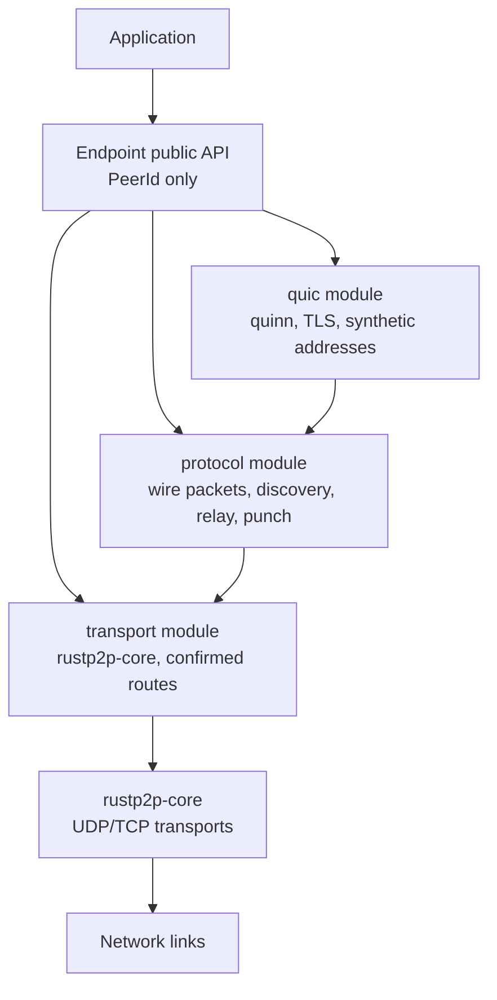

# rustp2p-quic Design

This document describes the current `rustp2p-quic` architecture. It is a
snapshot of the implemented design, not a roadmap.

## Architecture

The public API is based on `PeerId`. Real `SocketAddr` values are used only for
binding, bootstrap entry points, and internal transport routes. Once a peer is
discovered, user communication targets only the peer id.

## Layers

### Transport

The transport layer wraps `rustp2p-core::endpoint` and owns the confirmed
`RouteTable<PeerId>`. Its send API accepts already encoded wire bytes plus a
destination `PeerId` or a specific `RouteKey`.

Receiving a packet from `rustp2p-core` does not confirm a route. The transport
receiver caches `RouteKey -> core Transport` handles only so later confirmed
routes can reuse live send handles. The raw bytes and source `RouteKey` are
passed to the protocol layer for interpretation.

### Protocol

The protocol layer is the control plane and the only layer that decides route
confirmation. It builds and parses rustp2p overlay packets, runs hello and route
discovery, forwards relayed packets, maintains NAT observation state, and
coordinates punching.

The protocol layer keeps candidate state separately from confirmed routes:

- `pending_hello_routes`: raw-address bootstrap hello requests waiting for a
  reply.
- `pending_nat_observe`: direct NAT observation requests waiting for a reply.
- `pending_punch`: punch request ids waiting for a matching reply.
- `route_candidates`: inbound direct packet candidates that are not yet public
  confirmed routes.

### QUIC

The QUIC layer owns quinn, TLS configuration, application datagrams, reliable
streams, connection cache, and the synthetic address table. Quinn requires
`SocketAddr`, so `rustp2p-quic` assigns internal `127.255/16` synthetic
addresses as local handles for remote `PeerId`s.

Synthetic addresses are never public routing addresses. When quinn sends a QUIC
packet to a synthetic address, the adapter maps it back to `PeerId` and asks the
protocol layer to wrap it as `QuicRelay`. The protocol and transport layers then
choose the current confirmed route.

## Data Flow

### `send_to(peer_id, payload)`

`send_to` opens or reuses an end-to-end QUIC connection to the target peer and
sends the user payload as a QUIC DATAGRAM. The datagram frame is protobuf
encoded inside QUIC, then quinn emits encrypted QUIC packets. Those packets are
wrapped as `QuicRelay` overlay packets and sent through transport routes.

### `open_bi(peer_id)`

`open_bi` opens an end-to-end bidirectional QUIC stream. A small protobuf stream
header identifies source and destination peer ids, then user bytes flow directly
on the QUIC stream. Relays forward encrypted QUIC packets only; they do not
trigger `accept_bi`.

### Bootstrap Discovery

Bootstrap uses a real `SocketAddr` only to send `HelloRequest`. A matching
`HelloReply` returns the remote `PeerId`, peer summaries, and an observed source
address. If the reply matches a pending bootstrap route, the protocol confirms a
direct route.

### Relay Forwarding

Relays inspect only the rustp2p packet header: protocol id, TTL, source peer id,
and destination peer id. If the destination is not local, the relay decrements
TTL and forwards by confirmed route. For `QuicRelay`, the payload is opaque QUIC
ciphertext.

### NAT Observe and Punch

STUN updates only NAT type and public port range. Public UDP/TCP ports and IPv6
addresses come from direct peer observation through `NatObserveRequest` and
`NatObserveReply`.

Punching is allow-list controlled. A `PunchRequest` records only a candidate
route. A matching `PunchReply` with the expected request id is required before
the protocol confirms a direct route.

## Route Semantics

The route table stores confirmed reachability only.

- Direct route: metric `0`; the next hop is the peer itself.
- Relay route: metric `> 0`; the next hop is another peer that can forward
  toward the destination.
- Candidate route: local protocol state only; not returned by `routes` or
  `link_mode`.

Confirmation sources:

- `HelloReply` matching a pending bootstrap hello confirms a direct UDP route.
- Valid direct TCP control traffic can confirm direct TCP reachability.
- `IDRouteReply` and relayed route control traffic confirm relay reachability.
- `PunchReply` matching a pending request id confirms a punched direct route.

Non-confirmation sources:

- Inbound UDP packet observation alone.
- `PunchRequest`.
- `QuicRelay` packets.
- Peer store metadata or relay hints.

## Wire Format

The outer rustp2p overlay packet uses a compact v3 fixed header:

- first byte: `0x80 | protocol_id`, avoiding QUIC fixed-bit demux collision
- version
- flags
- max TTL
- current TTL
- total length
- source peer id length
- destination peer id length
- source peer id
- destination peer id
- payload

Control payloads use protobuf messages from `proto/rustp2p_quic.proto`.
`QuicRelay` payload is not protobuf; it is the raw encrypted QUIC UDP packet
emitted by quinn.

The previous bincode v2 payload format is intentionally not compatible.

## Security Model

User data is carried only by QUIC:

- unreliable user messages use QUIC DATAGRAM
- reliable user messages use QUIC streams

Both rely on QUIC/TLS encryption. rustp2p control packets are not a user payload
path. Certificate trust is delegated to the application-provided
`CertificateVerifier`, which is used for both server and client certificates.
The default `SkipCertificateVerification` is intended for tests and controlled
deployments.

## Public API Defaults

- User communication APIs take `PeerId`, not `SocketAddr`.
- `SocketAddr` is used for bind and bootstrap only.
- `send_to` is unreliable but encrypted through QUIC DATAGRAM.
- `open_bi` / `accept_bi` expose reliable end-to-end QUIC streams.
- `link_mode` and `link_info` report confirmed route snapshots; they may change
  as the route table changes.
